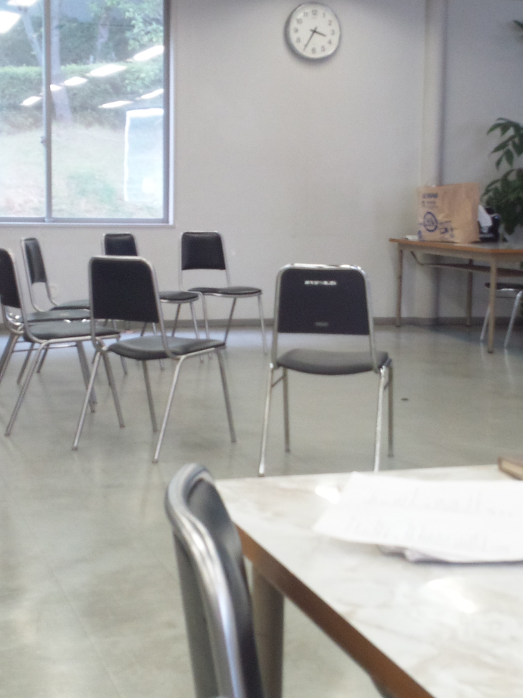

今日は台本読みと久々に立ち稽古しました

というのも８月２～４日までキャンプに行ってたんで！ρ(・o・)

で、キャンプの内容を細かくいうと文字数足りなくなるんでカット(^q^)

でも本当に楽しかったです

キャンプ幹事さんお疲れ様でした

そしてありがとうございましたm(\_\_)m

で、今日の稽古内容ですねー

まあ最初に書いた通り立ち稽古と台本読みしました

・台本読みでひたすらに台詞を覚えたり確認する

・立ち稽古で実際に動いてみる

私はね！体を動かすと！そっちに気を取られて ！台詞が！出ない！なんてこった＼(^q^)／

そして、本番で台詞がとびそうで今から緊張してます(>\_<)

そうならないように残りの練習期間、目一杯頑張るぞ！

というわけでもーりんでした

写真は(貼れてるか分かりませんが)立ち稽古始まる前の一コマです

人が全く写ってないのは偶然ですよ

