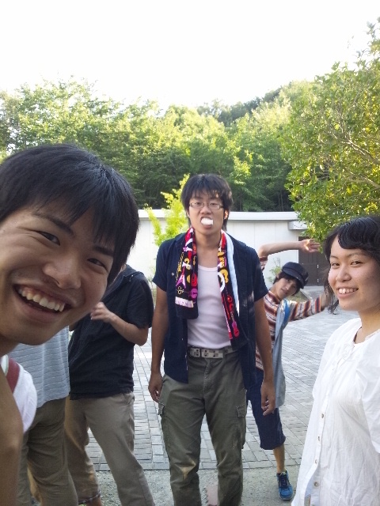
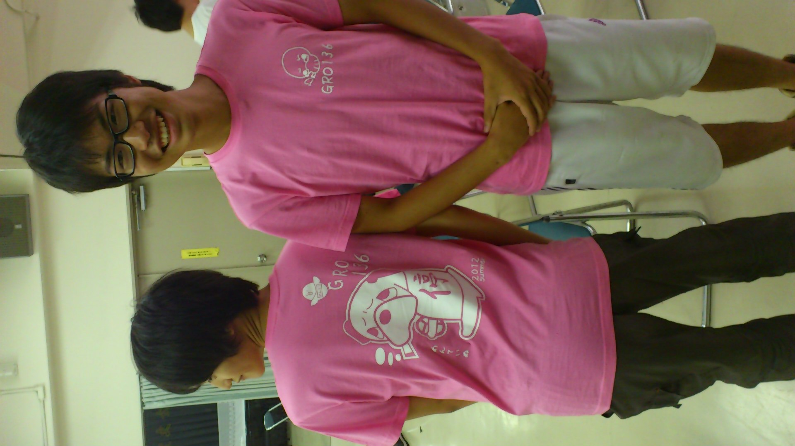

芥川公民館に咲く一輪の花！キュアガリオチーム！

すみません。

本当は一昨日のブログを担当していたのですが完全に忘れていたので今稽古場で書いてます。

金曜日の稽古は学校稽古でした。金曜日っていいですね。生協が空いてるのがすばらしいですね。

特に変わったことはなかったんですが、いよいよ私の出番が来ました。出番が台本の後ろの方からなのでなんだかとっても持て余すんです。

セリフもそろそろ完璧かもしんないです。でも本番は間違えるんです。きっとそうなんです。気づいてもそっとしておいてください。

帰りがけにかーびぃのおみやげのういろうを食べましった。今まで食べず嫌いしてきたういろうは意外ともっちもちしていて戸惑いました。

## (no subject)

今日は記念すべき初の芥川公民館での稽古でした～

しょっぱなから寝坊＆迷子で遅刻してすいませんでしたm(\_ \_)m

冗談抜きで遅刻癖を治していきたいと思ってる所存です…(; ´д⊂)

OBののりさんとしょうへいさんとクックさんに来ていただきました♪

差し入れごちそうさまでした(^q^)

今日は稽古の内容的にあまり指導とかがいただけなかったんでまたぜひお願いします(´ω\`)

あ、さいごに太郎さんデザインのチームＴシャツが完成したんでアップしときます！可愛さと免停の残念さが見事にマッチングしてますね！

一生愛用します！ちゃぱつでした♪

