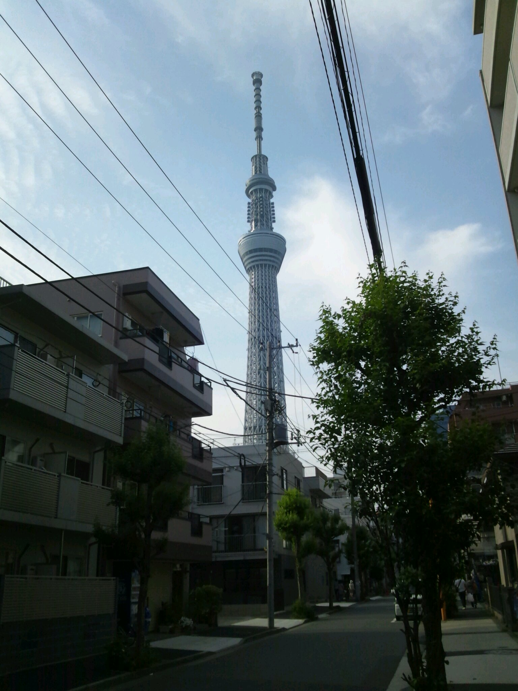

つーじーです

今日一日の名シーンをいくつかダイジェストでお送りします！

5:30 起床

17:45　エクレアを食べる

今日も今日とて稽古しましたよ！

今日は通し！自分の反省点も見つかり色々なものが見つかり放題です

明日も明日とて稽古です

日も短いんでさらにがんばろうと思います！！

今日の写真はとってません。なんかお盆に母親がスカイツリーとお台場合衆国行ってきたみたいなんで僕が6月に行ったスカイツリーをあげておきます

スパゲティ

では！！

## あばばばば

どうも、音響チーフのオリオンです。

今日は学校で10～17時から稽古でした！

実はテスト以来学校に上がっていないのです。

何気なく使ってるけど、学校に上がるっていう表現はうちならではじゃないでしょうか？

13時から通しもしました！

外でやりました。

マジで暑い...

...とくに床がやばかったです。

今日は音響機材を日傘で暑さから守りつつ、なんとか？

いや多分盛大にミスったけど？音出ししてました！

通しのあとシーンを返したりしてました！

OBのライスさんも来てくださいました！

そんな感じの1にちでした。

...そんなこんなで、実はもうそんなに日にちがないので、音響作業も最終段階に入ってます！

まぁ通し毎に課題が見つかるので少しずつ微調整していこうと思ってます！

それでは！
