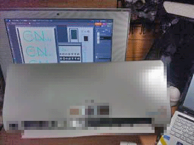

Hello! How are you?

正座しながら作業してたら足がつりかけた、４回生のかぁびぃです！

いよいよ日付も変わって今日から小屋入りです！

私にとっては最後の夏。目一杯残りを楽しもうと思います！

夏公演のあいだ、チーフとしてやってきた小道具は完成に至りました！

役者さんの動きがよくなるにつれ、私のイメージもどんどん膨らみ、あれもこれもと欲張ってしまいましたが、それもまた楽しいものです。

まだまだ本番まであるので最後まで詰めていきますし、本番で役者さんへのサポートも全力を注いでゆきます！

そして、今回大物が一つありました！

ネタバレになってしまうのではっきりとは申しませんが、わくわくしながら久々の大物さんを作らせてもらいましたよ。

やっぱりこういうのが好きだ！とはっきり言えます。

モザイクかけて写真置いときますね。　つ「写真↓」

ちなみにサイズ的に見づらいですが、モニター内のロゴなどもちょこちょこと使われておりますので、探してみてもいいかもしれませんね。

・・・もちろん、お話をメインに見てもらいたいですけどね？

とりあえず『粋なチラリズム』の有言実行でき・・・た、かなぁ？

それはさておき、本当によく仕上がってきました！

みんなで考えておもしろいものになっています！　ぜひお越しくださいね！

――後は野となれ山となれ。　天気だけは星に願いをかけて。

ではでは土曜日に会いましょう！　Have a nice summer! See you again!

## OBさん方へ

おじゃまします

総合制作の江藤です

当日オープンキャンパス開催のため、バスの混雑が予想されます。お早めにご来場をください
