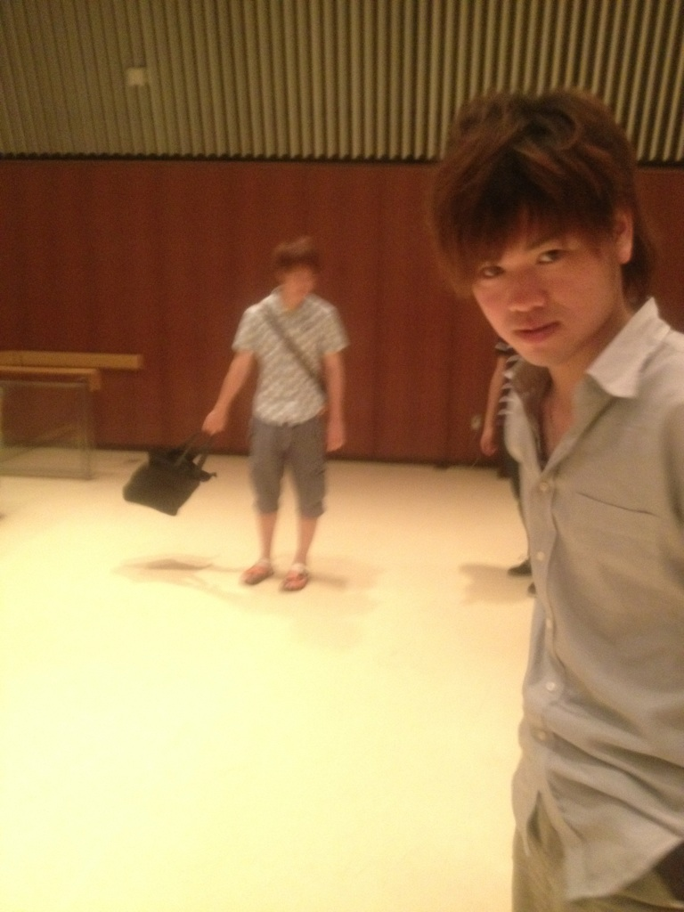

どうもユーリです。万絵巻18期生のユーリです。芸名の理由は面倒なので説明しません。知りたいなら直接聞いて下さい。

てなわけで初ブログだぜー！！多分だけど！今日はうちのチームの役者選考4日目です！いやー役者の人数多過ぎて頭パンクしそうですよ！でも楽しいので構わないけどね！

良い機会だからうちのチームの由来の説明でもしようかな。

ーーー劇団雨男、その頂点に君臨せしユーリ。彼の能力、それは万絵巻に所属する全ての人間から疎ましく扱われ、祝福の席すらも消し去る最悪の力。人はそれを、アクアパルスと呼んだ。アクアパルス、又の名を天候操作と言う。

ユーリのテンションが上がると彼の上空に雨雲が集結し、風雨を齎す。それがアクアパルスの由来である。

そしてその能力を持ちしユーリを、人は侮蔑の意味を込めてこう呼ぶ。

ーーー雨男、と。

まぁようは演出のユーリが雨男だから劇団雨男でいいんじゃないか、という単純なお話です。中2ですいません。

さぁ明日は選考最終日！役者がんばっ！

あ、画像は劇団雨男の癒し系チャラ男、ジュークです。先日二十歳になった19です。

