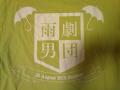
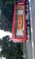

おじゃまします

総合制作の江藤です

当日オープンキャンパス開催のため、バスの混雑が予想されます。お早めにご来場をください

## あ め 男 ジャパン

今日は劇団雨男おそらく最後の学校稽古でした。

おわたーすんのも最後かと思うとどこかもの悲しい...

この夏は先輩と仲良くなったり稽古で真っ黒なったりなかなか台本覚えれんで焦ったりうまくできんくて自分にイライラしたり先輩に助けてもらったり..

ほんまリア充でした 彼氏おらんけど

リアル、リアル充実でした、日々が。

明後日は

完全燃焼やぁああー(\*o＞＜)o

清純派箱入り○談娘≒あーみん

## 本 番 直	 前 ！

どーも、左手ひとさし指を蚊にかまれ、痒みやらなんやらに苦しんでる散葉です。

ついについについに、本番２日前となってしまいました……！

心臓が蟻のように小さい私はもう気が気ではありません。

事あるごとに、発作の如く頭を抱え転がり回っておりますぅぅぅわあああぁぁぁぁ！！(泣)

本日の午前中は、万絵巻一同での仕込み作業！

初めて高岳館へうかがったのですが、

立派な施設に興奮しつつ、アワアワと雑用におわれておりました(\*´▽｀\*)

午後からはチームでの稽古！

突然の大雨にみんな演出を袋だt……、戸惑ったりもしましたが、

その後空に出現した大きな虹に、感嘆したり公演の成功を願ったりと、

なかなか楽しい稽古でした！(\*・ω・)

ゆーりチームも今、数々の困難を乗り越えた成果を、

舞台上で爆発させようとしている真っ最中でございます！(\*≧∇≦)o

役者一人一人の演技はもちろん、

振付担当としては、OPのダンスにも注目してほしいなんて思ったり思わなかったり。

というわけで、

劇団雨男『キノア now and future 』を、

ぜひお楽しみあれ！

## パイはまあ好き。

本番２日前です。まあそれについては誰か書いていると思うので詳しくは書きません。

最後の稽古＆仕込み！

これについても誰か書いていると思うので詳しくは書きません。

と現実逃避するはじめです。

そんなわけで未来を見据え元気がでる食べ物の画像を貼りました。

夏といえばウナギです。

本物のウナギ？写真を撮りに行ける金があるとでも？

## 絶品チーズバーガー

どうもどうもお久しぶりです！みんなの演出ユーリだお！！！！

今日ロッテリアの川越シェフ監修絶品チーズバーガーを食べました。マクドナルドで3個チーズバーガー買った方がいいとおもいます。美味しかったんだけど、なんかねぇ？庶民は分かるでしょ？

さぁそんなこんなで小屋入り一日目ですよ！仕込みですよ！…建て込みに参加出来てなかったから不完全燃焼ですが…

実は新発以降、舞台監督、大道具チーフ、舞台美術チーフ、演出、舞台監督、という重役連チャンなのですよ。今回は搬入指示に回りましたからね。

卒まで建て込みできないなんて…

そんなこんなで今日も今日とて稽古です。ゲリラ豪雨来たけどなんか最近逆に「あ～また来たか～」みたいに皆諦めてるよね。いいと思うよ。

雨が上がって生協横のとこで稽古。なんとなくボーッと皆の稽古風景を見てるとあーもう終わりなんだなぁとしみじみ思いました。

2ヶ月前、えびすさんに「夏の演出は、君だ」みたいなメールを何故か送らずその場で見せられたり、演出間会議で12人の二回生がうちに来たり、チーム発表で不満の声が上がったりと色々あったねぇ。

演出選考の時に幹部に向けてプレゼンしたこと、それは「まぁ夏ですし、汗かきたいんですよ！」です。…え？なんかよく分からないプレゼンですね…

とりあえず役者さんに言いたいことは死ぬ気で全力で楽しめ！ってことかなぁ(^-^)/

俺が最初の頃えつこやらに言った目標は結局果たせていないけど、これは皆が気づくまで何も言わないでおくほうがいいかな。あくまでキッカケ作り。

うーん…台本見たらわかると思うんすけど俺はこういう書き方好きなんだなぁ…なんか恥ずかしいからスピンオフ！！

いってきまーす！俺の名前は高野！どこにでもいるような普通な高校生。成績も運動神経も普通、好きな科目は国語、嫌いな科目は理科！好きなタイプは特にない。彼女なんかいりません。好きなスポーツは柔道、好きな

…なんか飽きた。皆続き考えてー。この子ネタ浮かばねぇもん！！！

じゃねっ！

さぁ、ココロコネクト8巻ステップタイムを読もう、うん。

iPhoneから送信
