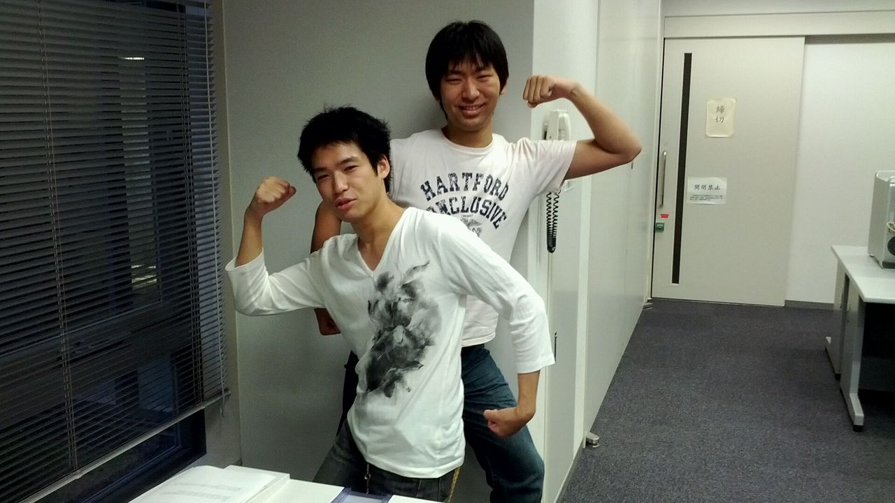

7/6といえば、一回生のアイルちゃんが記事を書いてくれましたね。

その裏で、舞台監督と制作チーフはこんなことをしていました。

～ＤＭ作業中の風景～（半真半偽）

……どうも、後ろの方の男・四回生のパッサです。

改めて写真を見ると、両方とも筋肉ねーなｗｗｗｗ

「なんでこんな写真があるのか」という経緯を順を追って話します。

最初に、どうも不思議なことに滑舌が悪いらしいです、私。マジ不思議。

そこで、誰だったかが「じゃあ、むしろボディランゲージじゃね？」と提案してくれました。

「よし、じゃあボディランゲージに挑戦だ！でも詳しいランゲージは知らないから、適当にやろう！」

ということで、適当にやりました。

前の舞台監督（イタリー）が「おはよう」で、

後ろの制作チーフ（パッサ）が「こんばんは」を表しています。

……表しているんです……

本当はこの画像も、取った直後のテンションの高さでツイッターに投稿する予定だったんですよ。

事実、携帯から投稿したんですよ。

……電波が悪かったのか、携帯が悪かったのか、反映されなかったんすよ……

しょうがないので、冷め切ったテンションで、今この記事を書いています。

あ、7/7の内容まで全然いけてない。くそー。続く

続いた。

そんなこんなで**7/7**です。重要そうなキーワードなので、赤太文字にしてみました＾ｐ＾

7/7、それはなんなのか！そう七夕です！いや、違う！合ってるけど！

他チームだけど、同じ万絵巻のコハルちゃんが参加している「かぼちゃのドガシャーン」の公演日なのです！！

見に行きました、ええ見に行きましたとも。チームの皆でゴッソリと見に行ってやりましたよ！！

感想は、ネタバレの雰囲気を孕みそうなので、一切言いませんが！！

ただ、一つ言えるのは、久しぶりに吹きました。

牛乳飲んでたら、前のお客さんが白髪になるレベルで噴出しました。良かった、飲食厳禁で。

その後、なかう（何故か変換できない）で飯を食べながらスタ会をしたり、ふれあい公民館で稽古をしたりしました。

稽古はエチュード祭りだった気がします。

つり橋エチュードやスイッチエチュード、果ては階級エチュードなどもやりました。

一回生が良い感じで面白かったです。上回生も負けて無かったです。

これ以上の感想は、ネタバレの（ｒｙ

台本稽古などもしました。

いやー、今回役者じゃないのですが、台本稽古をしている様子を見ると、若干役者をしたくなりますね。

でも、不思議なことに滑舌がよろしくないみたいなので、諦めます。ｼｸｼｸ。

終わり。

ＰＳ.帰りは椿proのメンバーと一緒でした。

あ、そうそう7/14ぐらいから椿proの公演がロクソドンタブラックでやるみたいですね。

よーし、見に行かないと！
