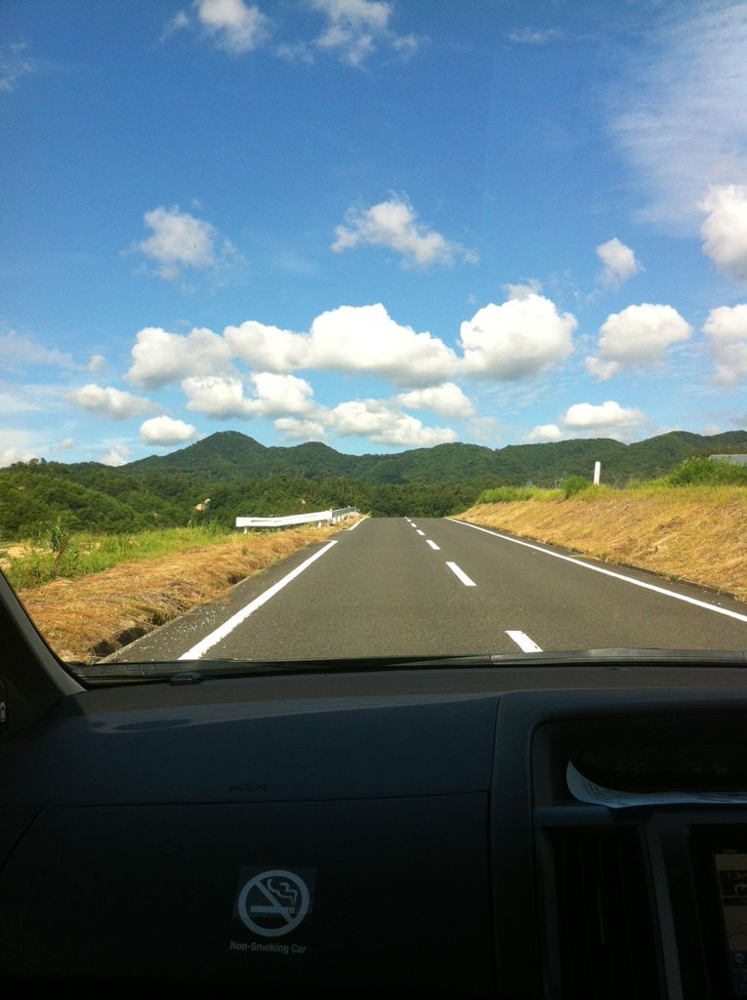

今日から山口組のキャンプについてのブログをあげていきますよー！

今年は京丹後市にある山の奥スイス村まで行ってきました

冬場はスキー場として使われているそうで、この夏真っ盛りでもすごい涼しかったです！

(朝晩はちょっと肌寒かったのは俺だけじゃないはず…)

一日目はほぼ移動してた記憶しかないけど車の中では一回生のともしとグルメが、そりゃあああああもう楽しそうでした^^

行き道に天橋立があるのですがそれは３日目の人が書いてくれるでしょう。

で到着後すぐに晩ご飯！もちろんBBQ！肉ウマー

飲んで走って飲んで走って飲んで吐いてしてたら、どこからともなくOBのライスさんが現れました。

ほんといつのまにって感じでしたw馴染んでましたwww

その後は持ちつ持たれつ倒れる様に寝ました。(僕は)

写真は道中。晴れてよかったー！！
