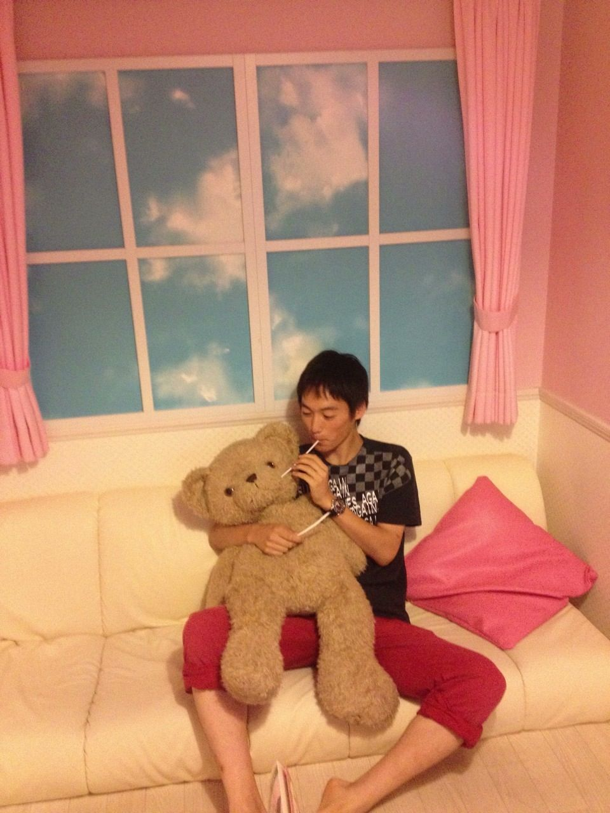

みなさん、元気ですか。私は元気です。うそです。日々虫さされが勃発しています。

夏バテ、熱中症、夏は非常に健康を脅かす問題が多発しますね。虫さされもバカにしないください、社会安全学部からのお願いです。

さて本日(7/13土曜)はOGさんのへむへむさんが一緒に稽古参加していただきました。去年は同じチームでいっぱい甘えさしてもうたのでOGさんと紹介することがちょっぴり切ないですな。

暑い夏はまだまだこれから。祭りやキャンプに.....

そう、球技大会！！！ 1年のうちで最も熱いイベントと言っても過言ではないでしょう。球技大会。私はバドミントンがやりたかったです。

ではでは猛暑でいつも以上に体力が消耗する今日このごろ。早めの就寝や十分な水分補給など体いたわってあげませう。 あーみん(2回)でした。

## 事故？自己？紹介

みなさん、こんにちは！

最近、カントリーロードをよく口ずさむ、一回生のスナフキンです。

さて、当チームは『自己紹介』です！

自分のことは、あまり考えない人間ですが、自己紹介がんばっていきます！

世間知らずの父と、元ヤンの母から生まれた、生まれも育ちも京都の男の子です。赤ん坊の時分は、おとなしかったらしいですが、今その面影はないですね。多感な少年時代を過ごし、現在に至ります(途中だいぶ省略)。

ところで、ぼくは万上回生の方から、たまに言われることがあります。それによると、ぼくは、とある五回生のOBさんに似ている…と。みなさん、お分かりですよね？趣味が恐ろしく合う、万で最も尊敬する先輩の一人です。

ただ、今はテスト前。似ている…ということは、ぼくも留年？なんてことが頭をよぎるんです、母も心配してるようで… ハイ、試験勉強がんばります！

それでは、みなさんのフル単を祈りながら、ぼくの自己紹介を終わります。ご覧いただきありがとうございます。
