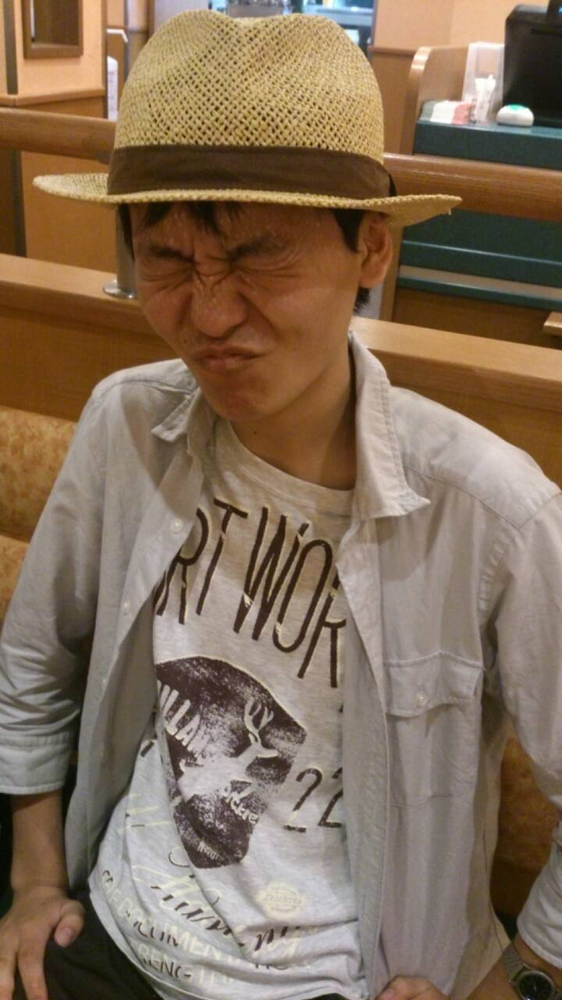

初ツイートをスパムに奪われたじょうたろうです。

土曜日の稽古の報告と事故紹介をします。

土曜日は発声練習の一環として、チームでカラオケに行きました 。

遊びちゃいますよ稽古ですよ。

さて事故紹介ということで、軽く自己紹介します。

帽子がアイデンティティーです

。

僕はミューズキャンパス民なので、授業が終わってからS棟に行くことが多いです。もっと皆と仲良くなりたいんですけど、学部の壁を感じる日々です。でもS棟には540円をかけて行く価値があると思っています。

性格はしっかり者です！…と言いたいところですが、皆はそう思ってないみたいです。

まぁこのブログ書くのも忘れかけてましたし、今日はたこ焼きとエクレアを床に落としたし、スパムに引っ掛かるし、ちょっとだけ抜けてる所があるんだと思います。

ついでに、パソコン操作が苦手なので総情の皆さん助けてください。

ひのきさんには、帰りの電車が一緒ということもあって、色んな話をしていただいたり、ラーメンおごってもらったりと、とても良くしていただいています。と同時に期待に応えなきゃいけないなと感じます。

もちろん他の先輩方にも大変良くしていただいています（茶ぱつさん…また食べに連れてってください）。

なので先輩方のためにも、自分の成長のためにも期待に応えたいと思っています。

食べ物はこぼしても、台詞だけはこぼさないようにします！

P.S. ブログ遅れてすみません。

四度寝とかしてて忘れてたわけじゃないですよ。 文章を推敲してたら遅くなっただけですよ。
