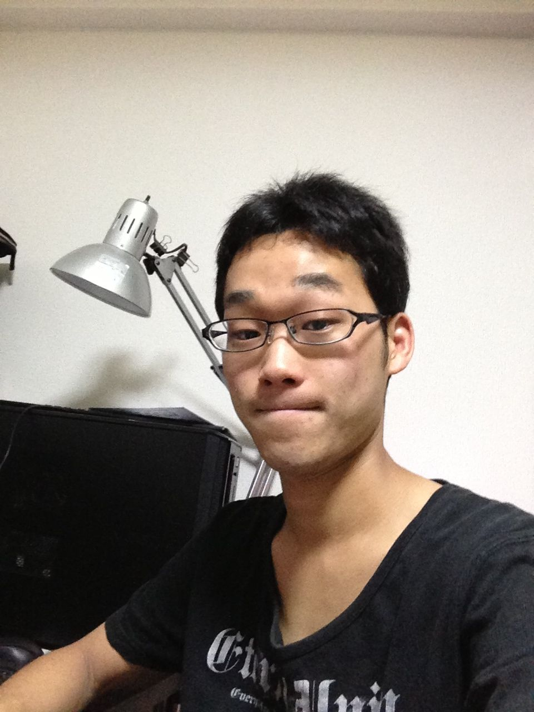

どうも?

昔の友に会うたび「全く変わってないな～」と言われ続ける(そんな馬鹿な…)一回生のキャメロンです。

おそらく皆さん「何故にキャメロン？」と疑問に感じる方がなきにしもあらずではないでしょうか?

実際僕もよくわかってません(´･Д･)」

(詳しくは同じ一回生Y子さんまで)

そんなことはさておき、簡単な事故紹介をさせてもらいます。

僕は生まれも育ちも京都ですが、両親は長崎であり子どものころはよく長崎に遊びに行ってました…………車で(いや～遠かった)

そんなこんなで楽しい幼少期を過ごしなんやかんやで大学生に(特に語ることがなかった（涙）)

とりあえず事故紹介これぐらいにして続いて、

テスト期間中であったためにみんなで稽古ができませんでしたが8/1日をもってテストが無事？終了し、それと同時に稽古も再スタートしました

しかしテスト明けということで皆さん疲れが見えていました(みなさんゆっくり休んで下さいね)

自分にとっては万初めての夏公なので1回1回の稽古を大切にして、この夏一皮剥けるように頑張っていきたいと思っています(^-^)/

また、8月中には球技大会やキャンプといったイベントもあるので楽しむ心も忘れずにいきたいです！

以上、キャメロンでした?
