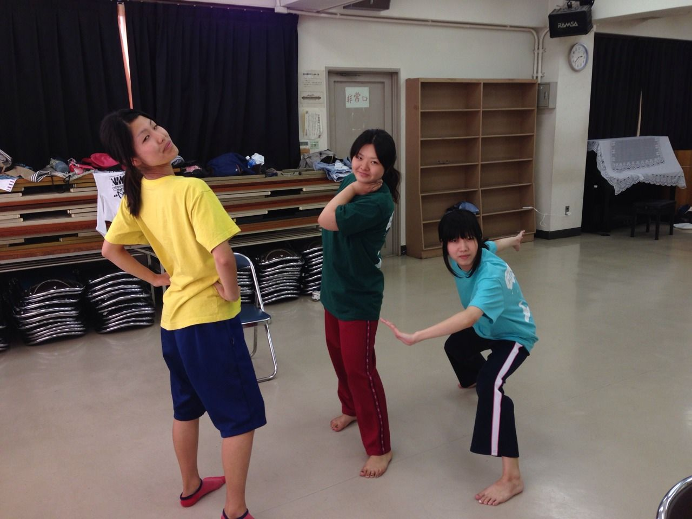
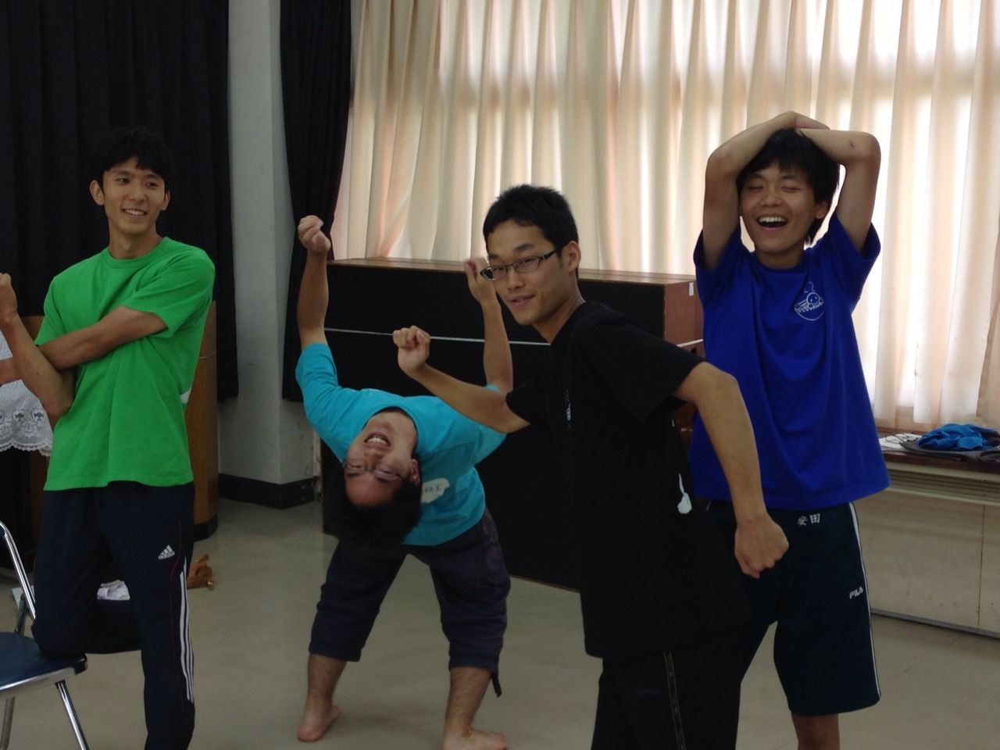

お疲れ様です(^^)

2回生のなつのです。

昨日は、学校稽古で走って水浴びして、エチュードの奥深さを改めて知りました!!

水浴びしながらのエチュードは、新鮮で気持ちよくて、楽しかったです(笑)

さてさて、今日は一転芥川公民館での稽古でした!!

サーキットをして、へとへとになりながらも達成感を感じられるようになってきましたよ(^-^)/

今日は役者が1,2回生だけだったので、元気な2回生女子worldが展開し、演出さんと1回生男子たちを引きぎみさせていました!!私も含めて(笑)

これからの野望としては、この謎女子worldの回生を上にも下にも広めていきたいと思います!!

これからもうすぐ稽古もラストスパートです!!

スタッフさんも含めて、全員で力を合わせ夏公を作り上げていきますので、

ひのたまりの公演をお楽しみに!!

これからのblogにも注目よろしくお願いします!!!

## お盆稽古!!!写真

写真をあげわすれていました。

今日の稽古指導風景です
