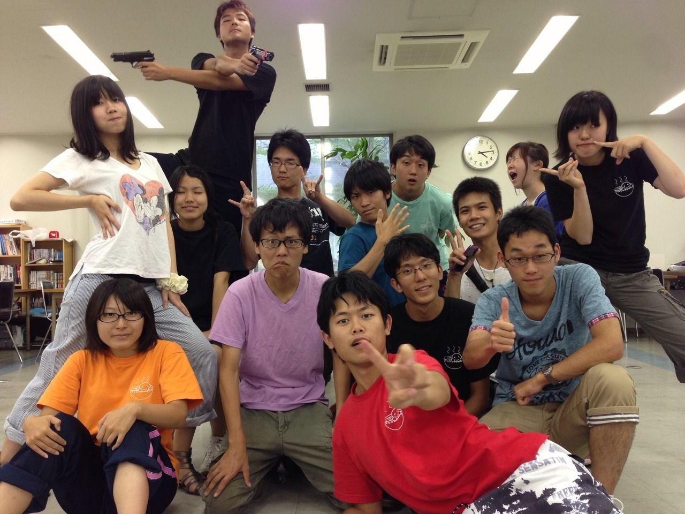

ハァイ！万絵巻四回生の朝食はヨーグルトドリンクとトーストのほう、ぱとらです！

一体何人がこのネタをわかってくださるのか…もしいたら今度の映画一緒に見にいきましょうね( ^ω^ )

いまさら上回生は自己紹介なーんてしないようでちょっと考えてた私が恥ずかしい＼(^q^)／うへへ

そっと何事もなかったように今日の話を始めたいと思います・・・・

さてさて、今日は学校にて通し稽古でしたー。

河原とかの自主練の成果がでてる人がどんどん増えてきて、

あばばばばがんばらねばばばばば

とみんなが相乗効果で上がっていきそうないいかんじです！

というか私が勝手にあばばばしてるだけですかそうですか。

みんないい感じみたいなので負けないようにがんばりまする。

役者さんだけでなく、各役職のお仕事も着々と…むふふ、でございます( ^ω^ )

演じる側ですがとっても楽しみです＼(^q^)／うひひ

そしてそして、本日はスペシャルゲスト！

万絵巻15期生 ライスさんが遊びにきてくださいました＼(^o^)／やったね！

っていっても本来の目的は別件だったようですが

「本番見れるようになったし、通し中は別のとこで待ってた」

なんて嬉しいお言葉も。

本当にありがとうございました！

というわけで記念にパシャり。

「どうぞ真ん中に！」ってしきりにみんなが言ったんですが、この場所がよいとのことなのでそのままで。

はたしてみなさんはライスさんがどこにいらっしゃるか、もう見つかりましたか?

お話によるといろいろお忙しいようで次にお会いするとなると本番なのだとか。

本番お待ちしてます！

というわけで、取り留めもなくなってきたのでこのへんで。

以上四回生ぱとらでした( ^ω^ )
