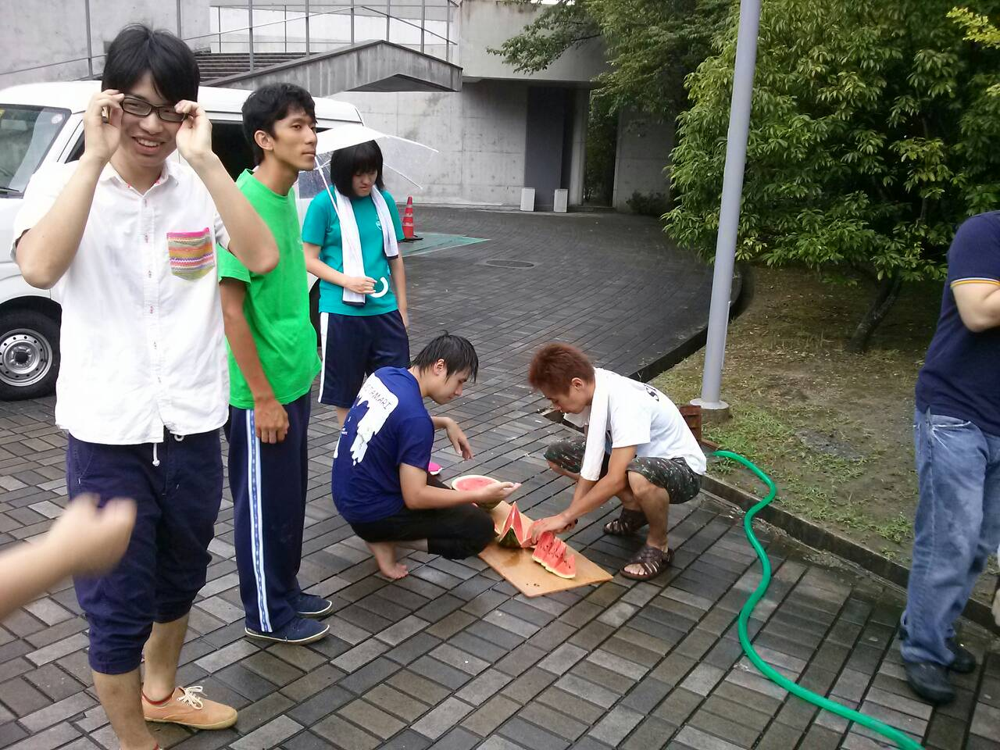

どうもどうも、３回生のたろうです。

みなさん元気ですか？たろうは元気です。

この夏はおいしい料理をたくさん作ってるので絶好調です。

いい食材が入った日はテンションが違いますよ。

食材といえば今日はOBのあずささん、つーじーさん、みゅうぽんさんが稽古場に遊びにきてくださいました！

あ、いや、このお三方が食材ではないですよ。

なんと差し入れにスイカをいただいたんですよ！

しかも生でスイカの解体ショーが見れるとは！すごくきれいに割られてました。

僕らもキャンプの時に海でスイカ割りという風流なことをしたのですが、そのときは割ったというよりかは叩き潰したと言うほうが適切な形状になったので、今日のスイカにはアートを感じました。

スイカは聖チームと一緒においしくいただきました。

ありがとうございました！ごちそうさまでした！

さて、稽古も大詰めです。

１回生がどんどん良くなっていくのを見ていると小学生のころ育てたピーマンを思い出します。

育てたピーマンは他の食べ物と比べて断然においしかったです。

あのときのピーマンのようにおいしい果実を作るために僕は水をやり続けます。

今日の晩御飯はカップラーメンでした。
