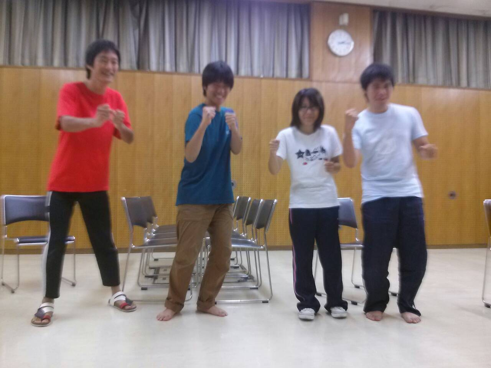
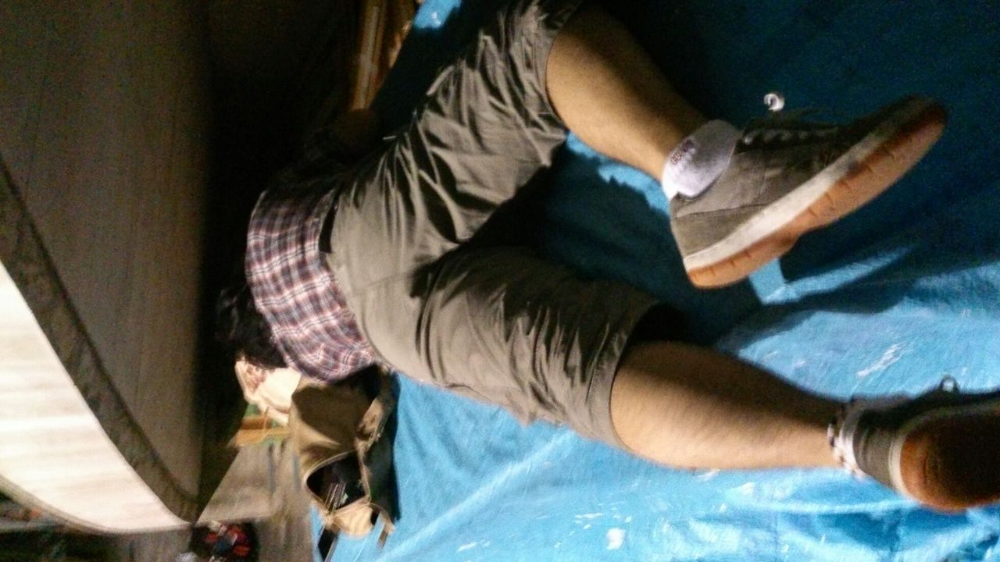

どうもこんばんは

本日とある理由で和田くん呼びになってみんなとの距離を感じたナスカです。

何があったかは………聞かないでください………(゜ロ゜)

そんなことより今日は題名の通り、帰ってきました！

スナフキンが！！

ハワイから！！！

先週１週間いなかったので凄く久しぶりでした。

なのでひたすら今日はスナフキンの出るシーンばかりやりましたよ。

もう本番まであと１週間ぐらいなんですよね………

もうどうしようっていう不安な気持ちともう終わってしまうのかっていう残念な気持ちに苛まれています(>\_<)

これは２回生になっても変わりませんね。

だんだん完成には近づいてきていると思うので悔いのないよう最後まで全力で走り抜きますよー！

PS,写真は本日のエチュードＭＶＰです！

## 私は風になるの

ちゃぱつです。こんばんは。みなさん夏を満喫してますか？僕は楽しんでます。去年と同じく万絵巻にささげてます。でも楽しいからOK！！

今日は通しをしましたよー。上回生ももちろん一回生の成長がすごいです。日に日に伸びてて去年の自分なんか比べものにならないです。みんなすごい！

成長がメキメキ目に見えて嬉しい楽しい気持ちいいです。最後のは語呂のために付けました

まあそんなこんなで通しがありましたよって話です。

稽古の後は聖さんチームと合同自主練してました。ワイワイ騒ぎながら水鉄砲と原チャリで真面目に(？)してましたよー！

そして今みんなでラーメン食べに来てます。みんな大好き希望軒飽きたなんて言わせない。

以上、今日の報告でした！

写真は大道具置き場の精霊です。
