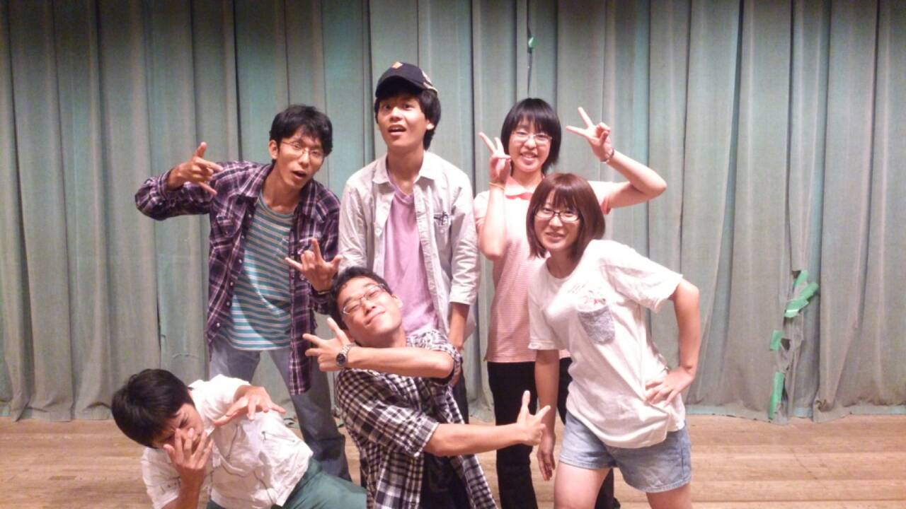

最近の涼しさ(というか寒さというか)に夏の終わりを感じますね、どうも皆さん昼でも夜でもおはようございますアキラです。

まあきっと数日したら夏の暑さが戻ってくるような気がしますけどね(笑)

さていきなりですが少し過去を振り返ってみます。

夏公チーム分けの日、ミューズ民の方が多いのもありそれまでそんなにしゃべっていないという人も少なくなく、実は期待半分不安半分がありました。

しかし、少し月日が飛んで(もちろん間にも球技大会やカラオケ、お祭りやランニングサーキット等々の楽しいイベントもあり、仲良くなれたと思いますが)キャンプ。これがあってこそ今のひのたまりチームがあるんだと思います。色々ありましたが忘れられない日となりました(\*´ω｀\*)

余談ですがキャンプの次の日の稽古でのテンションの高さに驚きましたね(笑)

役者については私という素人目に見てももの凄く成長していますね！

特に一回生の皆。彼らや彼女らがあんなキャラになるとは数月前には思ってもみなかった。この成長もテンションの高さ、また先輩方の指導あってこそだと感じました！

そして同時に他チームの一回生もとても成長してるんだろうなーと期待してたりもします。

ふぅ、そんなに過去を振り返っていない気もしますが時は現在、本番前日です。

怪我することなく、また寒いので風邪ひくことなくいきましょう！あと喉にもいたわってあげて下さいね、他人事ではないですが。

それではではー(\*´ω｀\*)

P.S 写真は今回役者をする一回生たちです。よく見るとタイトル「二回目」@しおりん に載っている写真とはポーズが少しだけ違いますね(\*´ω｀\*)
