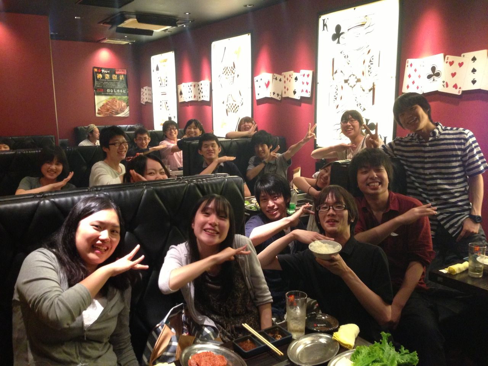

おはようございます。

こんにちは。

こんばんは。

挨拶って大事だよね(二回目)。三回生のふぶきです。TC公演以来です。

さてさて、我らが課長チーム「劇団津野ル思イ」は昨日打ち入りへ行ってきました！焼肉うめー。

と同時にキャスト発表も…(・∀・)演出から手渡される封筒での通達にみんなドキドキ()ワクワク()でしたよ。うん、自分で言っててちょっと恥ずかしいです。

僕も役者で出ますよー。どんな役かって？9月くらいには分かるんじゃないかな！

※演出は終始とっても楽しそうでした、まる。

来週から稽古も本格的に始まる夏公演、気合入れて頑張りましょー！\*\\(^o^)/\*

ではまた！

ちなみに写真のポーズはチームのマスコットキャラクター、フクティのポーズです。フクティは速すぎて見えないのです。決してアイーンでは無いのです。右から左へ流れます。

## ちょっと訂正

先ほどのブログで「劇団津野ル思イ」と書きましたが正しくは「劇団 津野ル想イ」です。それだけです。ふぶきでした。
