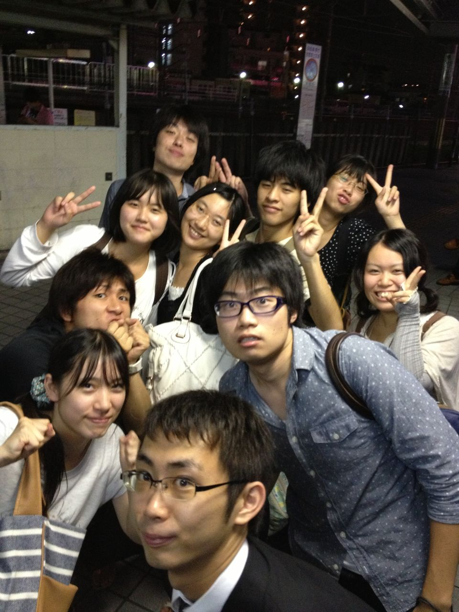
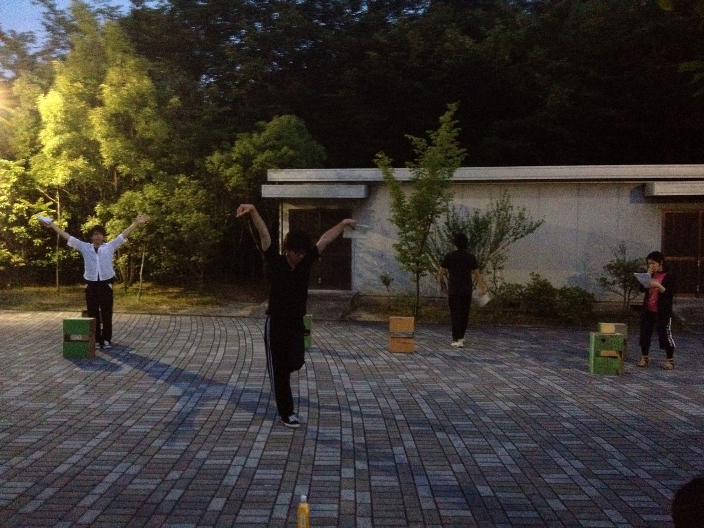

こんにちは、4回生のとちぎです。

いやぁ早いもので最後の夏公なんですね。

感慨深いなあと毎公演で思いますが、

夏公演ではそれも５割増しですね。

この前まで１回生の夏として送っていたのに、

今では最上回生とは……

あのころの上回生たちのように教えられているのか不安ですね。

さてさて、きょうの稽古は

一回生の発声を中心に稽古しました。

「腹式呼吸」「声を大きくする」「喉を開く」などなど、

様々な単語が入り乱れましたが、

改めて「発声」の難しさに打ちひしがれます。

でもでも、一回生からは

「本番までには絶対頑張ります!!」と

ポジティブな声もあがり、日々頑張っていきたいですね。

シーン稽古はクライマックスまである程度の段取りがつきました。

タイトル通り、うちのチームはもうすぐ荒通しなのです。

一回生にとっては初めての荒通しになるのかな？

いやはやどうなるのか楽しみですねぇ。

一回生の演技を見ながら、

初々しさに懐かしさを覚えながらも光るものを感じるとちぎでした。

写真は解散後に「ギュッと！」って注文した集合写真です。

## ともしだよ

こんばんわ

ともしです。

しばらくぶりですね

久々に稽古場に出向きました

いやぁ、やっぱり稽古は楽しいですね

肺活量が思ってた通りなくて焦ったけど

台本稽古は謎の段取り付いてるし、一回生もはじめの頃よりは慣れてきてるのかなってかんじですかね

あっ、今僕は軽い社畜です

社畜になってから万がいかに生活の一部だったかを改めて気付かされましたね

あと、総合舞監として公民館の予約を取りにいくことがすごく楽しい！

灼熱地獄を機動力0の赤チャリで恐ろしく走り回るだけなんですが、想像以上に楽しいですね

そんなこんなである意味充実した夏を送っております。

ではでは熱中症には気を付けて。

## ともしです

こんばんわ

今日の稽古場です！
