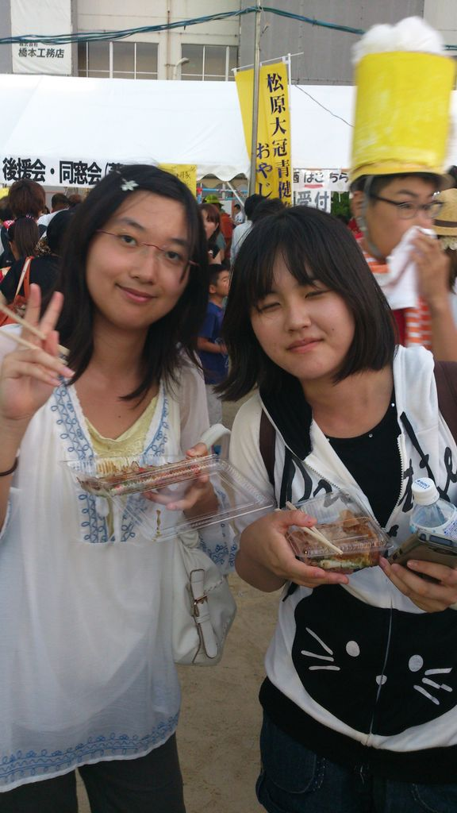

ハーイ1回生女子で足が筋肉痛のほう、綾鷹です。

日頃からの運動って大事ですね…（遠い目

一先ず簡単に自己紹介を。

音楽はボカロ好き。動物は猫派。影とキャラが薄い。

最近甘いものが食べたい症候群が止まらない系女子です。

さてさて、今日の練習は、発声のち台本読み合わせでした！

長台詞の悪夢に苛まれながら、自分の滑舌の悪さに絶望しました。

早口になる癖を直すのが、今後の課題になりそうです……(´・ω・\`)

そして、今日は高槻祭に行って参りました！

しゅーぞうさん、課長さん、うみちゃん、ぷー、出雲という1回、4回面子で行ったのですが、とても楽しかったです！

殆ど食べてばかりでしたが(笑)

そう、昼御飯抜きの体では屋台の誘惑に勝てなかったのです。

食べ過ぎた感が否めません…お金が…

明日参加する方は食べ過ぎ注意です！

以上乱文失礼しました！

次の1回生に乞うご期待！
