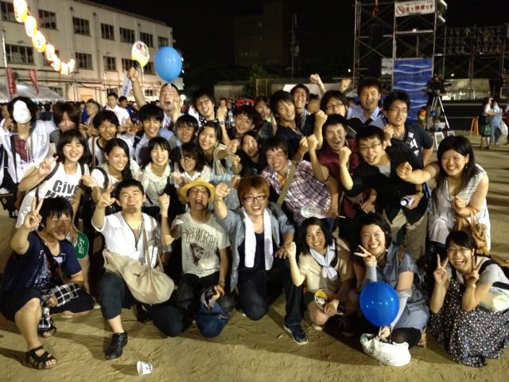

どーも、一回生の武隈(プー)ですm(\_\_)m

まず軽く自己紹介から。

バイトしてないプー太郎です。

一回生で一番のクズです。

今後はとりあえずコミュ障なのを改善することが目標。

今日は一日でいろんな事がありました。

第一、プーから脱するべくバイトの面接へ。

確実に落ちた(キャンプのために3日、帰省に一週間無理と言ったら(￣Д￣)な顔をされるという…)

第二、面接の後に稽古へ向かう。

だいたい14時くらいだったので暑くて暑くて2回くらいくじけました。

第三、高槻祭り

人が多すぎて若干人に酔う…

それと、皆々様のコミュ力の高さに嫉妬。

楽しい一日でした。

明日は球技大会なので早めに寝ます

(( \_ \_ ))..zzzZZ

晴れるといいなぁ
