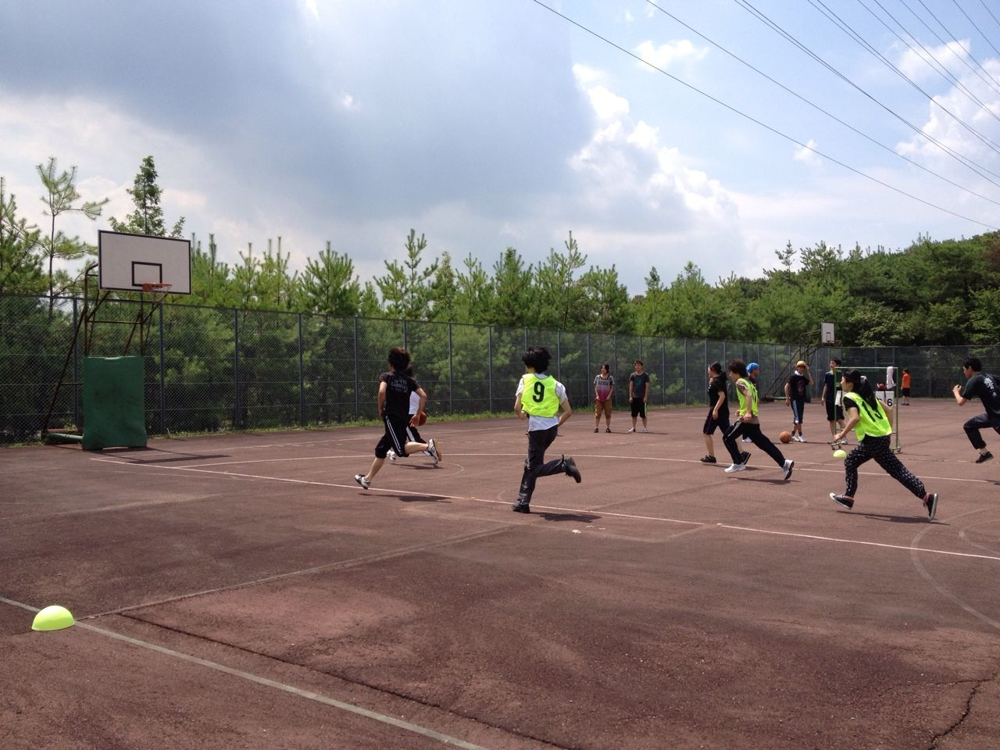

球技大会どうでしたか？

(あー、ミルクティー飲みたい)

優勝は出来なかったけど、

僕はとても楽しかったです。

(時々ボッチなのは気のせいかなぁ)

ただ１つ心当りなのが、

せっかくのイベントなのに活躍することはさながら、スベることすらできなかった事です。

(この夏、予定がパンパンで充実度ぱないな)

もっと精進したい。

(もっと寝転んでたい)

そんな一日でした。

(また、BUMP のライブ外れたんですけど！

大会後は、活動紹介を兼ねた全体練習。(よつばと！の普及を考えてます)

くたくたな身体での発声は軽く地獄見ましたね．(あー幸せってなんやろな)

でも、今日がほんとのほんとに全体で集まるのが最後かな？

(キャンプの用意が終わらないのですが。)

次会うのはきっと舞台ででしょう。

(最近教習行ってないよ……)

ところで、気になりませんか？僕が誰だか。

(こりゃもう無理かな)

えっ、なりませんか。そうですか、はい。

でもここまでの文章で分かった貴方は辻村検定3級程度の実力があります。

以上、らむでした

本日の格言

【禿げても、禿げられるなっ！】
