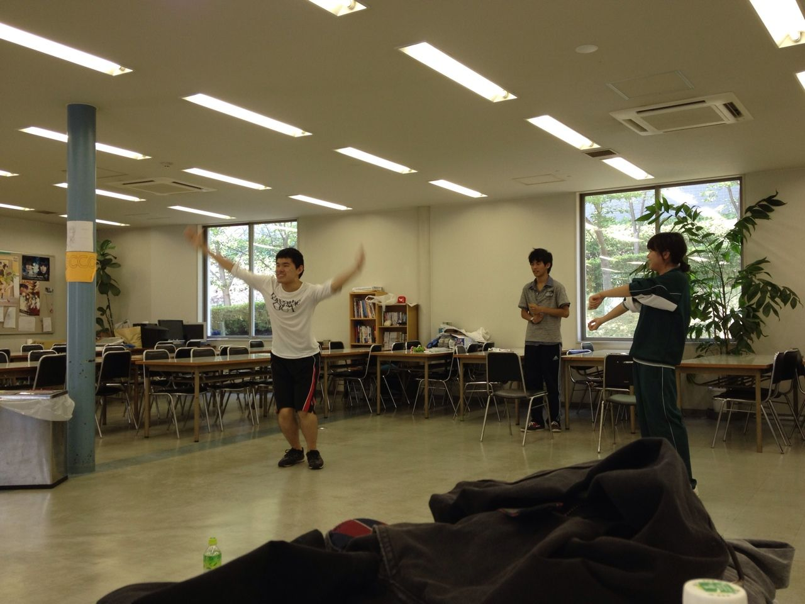

うみです。

高校では美術部と生徒会をやっていました。演劇は大学に入ってからの挑戦です。

美術部では副部長、生徒会では副会長をしていました。サポート役が好きです。

趣味は絵を描くことです。

絵の具で、食べ物や花を描くのが好きです。直球で伝えたいテーマが伝えられる気がするからです。

七月下旬、富田公民館に行く道を散歩していると、蕾が膨らんでいる立派なヒマワリが幾つも植えられているのを見つけました。

太陽に向かってまっすぐに伸び、堂々と生きているヒマワリに、勇気をもらいました。(テストに立ち向かうための)

「テスト終わったら描きに来よう」と決意したのですが、テストが終わって見に行くと一本残らず消えていました。

一体どこにいってしまったのでしょうか(・ω・)

そしてポケットモンスターspecial(通称ポケスペ)が大好きです。クラスタです。

何があっても９月１日の梅田のサイン会に行きたいです。ええ、例え稽古があったとしても。(問題発言)だから、八月中に出来る限り演技を上達させたいです。

頑張ります。(白目)

ところで最近、一回生だけでエチュードをするように言われることが増えてきました。

画像は、「伝説の夏フェスエチュード」と呼ばれるようになったエチュードのワンシーンです。

どうして伝説なのでしょうか。

私も出演していたようですが、しかし身に覚えがありません(あさっての方向を見つめながら)

うみちゃんだよ～～！♪

…いや、なんでもないです。暑さで頭がイってしまいそうです。

さて、昨日の球技大会の疲れも残っていますが、津野ル想イは明日から三日間、

＼キャンプ／です。

どんなキャンプになるのか…とても楽しみです(\*^^\*)

皆さん体調管理にはくれぐれも気をつけて、楽しいキャンプにしましょうね！
