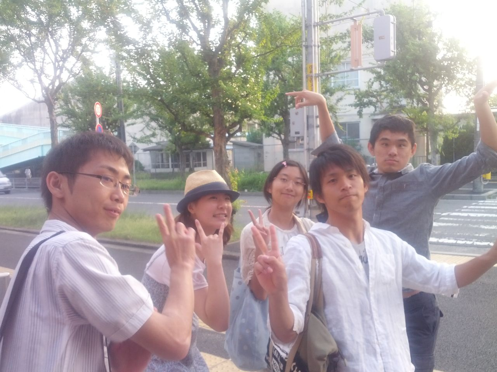

どうも新(OB)一回生のペパッサです！

ええ、はい。なぜかチームブログ書いてます。もちろん事情があるのです。

長くなるので、端折りながら書いていきます。ここらへんの判断はさすがのＯＢですね。

クリアファイルをふぶたん(3回生のナイスガイ)に返すついでに稽古見学。

→稽古終了後解散時、誰がブログ書く？という話題に。

→瞬時に誰も手を挙げないので、一計を案じる。

→そうだ、ダ○ョウ倶楽部だ！！

→俺「じゃあ、俺がやるよ」

→課長「あ、じゃあパッサさんお願いします」

＼(^o^)／オワタ

要らない……！そんな鶴の一声……！！

～(^o^)～ぐにゃああああ

そんなわけで、こうして筆を取っているわけです。

本題。稽古見ました。

終りの一時間半ぐらいしか見ませんでしたが、やはり一回生からどことなく若々しさが香ってきて良い感じです。

ＯＢだと当たり障りのないことしかかけないですね。ネタバレにいつも以上に気を使います。

9/7(土)是非とも一緒に見ませんか！と唐突に宣伝をして筆をおきます。

あ、明日からは現役生の若々しい稽古日報に戻りますので、明日からの日記にご期待下さい！！

P.S.写真は解散時に取りました。お盆期間はさすがに人が少ないですね。
