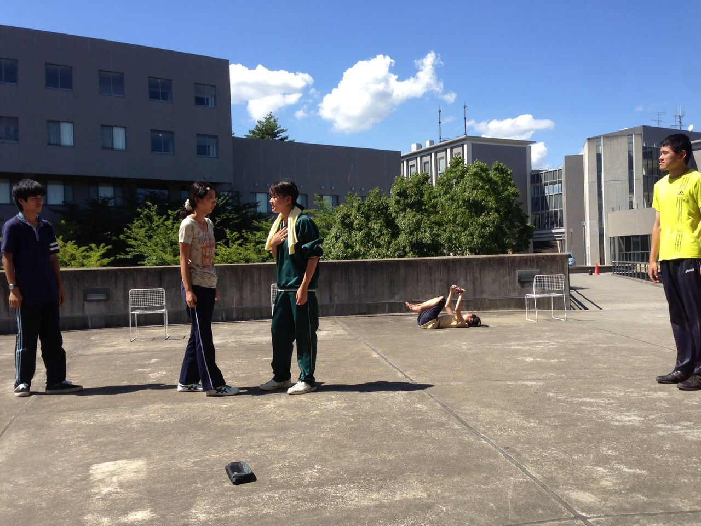

どうも、三回生のふぶきです。今日は自主的に綴りますよ。

さて、本日の稽古では一回生を中心にどれだけ台本を覚えているか＆段取りと動きの確認を兼ねた全シーン練習(通しじゃない)を行いました。いろいろ楽しかったですが正直めっちゃ暑かったです。

ちなみにスムーズにいけば90分のシーン練習をした後みんなでプールへ行く予定でした。

予定でした。

「でした」。

気がついたら炎天下で4時間以上やってました。ええ、舞台はほとんど日向です。焼き肉になるわ。

(焼肉たべたい)

とくに出突っ張りの一回生ズは夏日の暑さというのもあってかなり苦戦してました。まるで去年の自分を見ているような。

(セリフ多いと大変だよね)

当然僕たち上回生ズも苦戦してました。出番じゃない場面はみんな大丈夫かなーとか思いつつ見守ってたり。

(ところでプール行きたい)

ま、まあ明日からは建物の中で練習できるし！大丈夫だし！

(プールに行きたいのです)

ただ本音を言うとシーン全体の練習が出来てスタッフの作業もかなり進んだのである意味充実した一日でした。夏って感じですねー！

(今度みんなで行こうよ)

お盆も過ぎて本番まで残り二週間、やる気全開の新人たちに負けないよう気合を入れ直して頑張っていきます(\` ・ω・)

(とりあえず泳いでくるか)

それでわ！

※写真はシーン練習の1枚。奥の方では同期のえっちゃんが干上がっております。みんなほんとお疲れ様でした！
