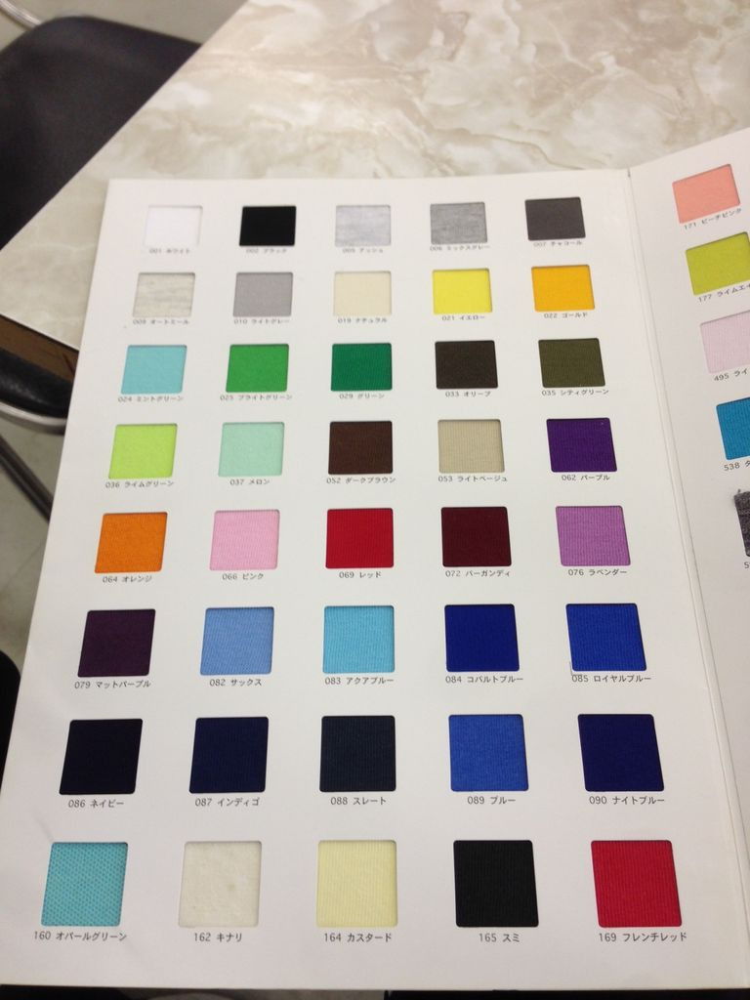
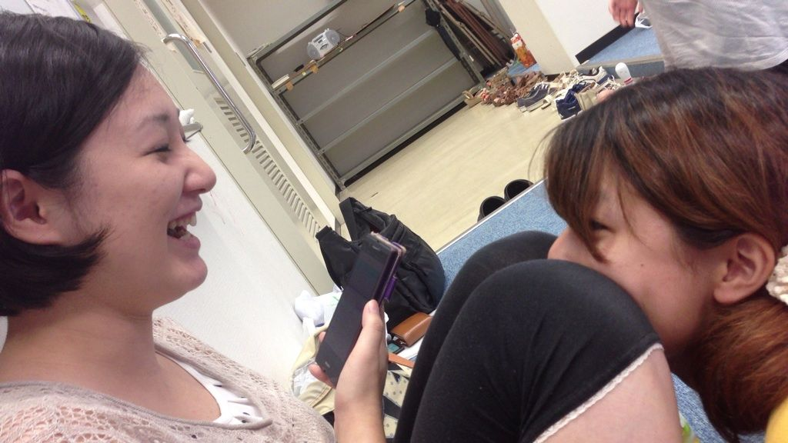

どうも。3回生のふぶきです。気がついたら朝だったよ。

さて昨日はコミュニティルームで稽古してましたよ。久々のコミュニティルーム、久々のカーペット生地、テンション上がるね！上がりすぎた結果アクエリアスと間違えてファンタのうめ味を買っちゃったくらいです(実話)。

改めて台本の理解と役の心情を把握しようということで演出たちによる熱烈指導やら動きのメリハリをつけるための甘い香り(7ぼうずver.)やらを丹念に繰り返しました。初心に戻った感覚がすごいです。

そんなこんなで本番まで約2週間ですね。早いですね。泣きそうです。うえーん。

そろそろゆるーい腹痛も治ってくれないかなぁ、とか思いつつ今日の準備をします(´・ω・\` )

でわでわ。

写真はチームTシャツのカラーサンプルです。どんなのになるのかわくわくです(((o(\*ﾟ▽ﾟ\*)o)))

## ２週間…!

うみです( ・ω・ )こんばんは!

画像はOBさんと冬花さんです!!

今日はスタ会がありました!

本番に向けて、作業が着々と進んでいたり完成していたりしてます。

本番まで残り２週間となりましたね…!!

役者として、あと三ヶ月くらい練習時間欲しいですが、２週間なんですね!現実は厳しいです。

練習は、日々(いろんな意味で)密度を増してきています。

今日は、シーン練習を重点的にやりました！

二人のOBさんが見守って下さる中、また一つ有意義な稽古が出来たのではと思います!!
