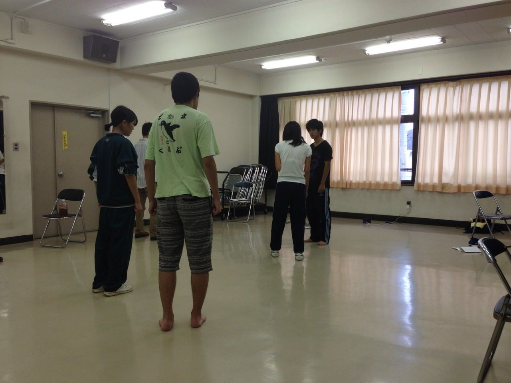

こんにちは、あやたかです。

今回は写真無しでお送りします(´・ω・\`)

今回の練習はひたすらシーンの繰り返しをやっていました。

声だしや表情などの課題がまだまだ残っていて、大変です(´・ω・\`)

その横で、ずっとストレッチしていた方もいました

まぁ、誰かはここ数日のブログを見れば分かると思いますが、そう、超合金こと出雲です。

関節年齢がひどい結果に終わっていた出雲でしたが、もーりんさんや、ふぶきさんの扱きで、昨日よりは大分ましになったと思います。

このまま柔らかくなるといいのですが…

さてさて、公演まであともう少しですね。

気合い入れていきたいと思います。

それでは！

## そろそろカウントダウンすべきかな？

夏公本番まであとわずか！

一回生は特に緊張がピークに向かっているのではないでしょうか？

ここ最近の稽古も一回生が中心のシーンを重点的に行っています。

そんな僕も一回生！若干緊張もしてきました＼(^o^)／(本当ですよ。)

しかし、僕は役者じゃない。

役者じゃないがゆえ、落ち着いて同回の役者の演技を見ることができます。

みんな細かな仕草などにも気を遣ってより良いものへ仕上げようと必死です。

本番への緊張とともに、他チームの同回正の演技がどのくらい向上しているのかを観るのが楽しみで仕方ないです(^-^)

文章の推敲を一切しないプーでしたm(\_\_)m
