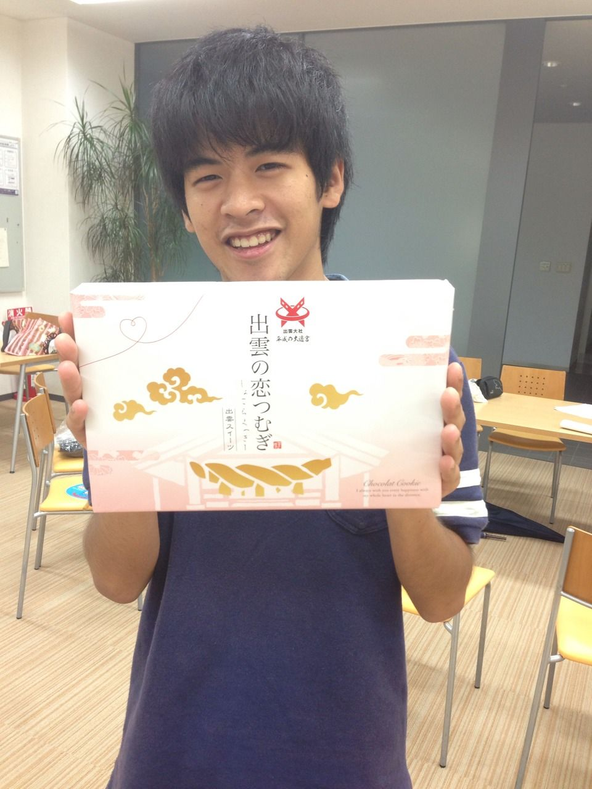

どうも、

変えるべきパーツをすべて入れ換えるとイケメンになれる

可能性を秘めているらむです。

昨日は帰ってきてすぐに寝落ちピーポーだったので今、blogを書いている所存です。

さてさて、夏公ももう終盤ですね。

野球で言うなら九回表二死満塁って所ですね。

麻雀で言うなら、オーラスで親がリーチをかけてる感じですね。

はい、ちゃっちいおふざけはここまでにして。

皆さま、あと二日で小屋入りですよ。信じれますか？

まぁ、残り二日っていうのをどう捉えるかによりますが。

己の完成度、舞台の完成度、

がんばって高めていこう。

そうそう、昨日

チームの人と御飯を食べている時に

「もうこの面子で飯食いに行けるのもラストかも知れんなぁ」

という話になりました。

今週で、チームは終わりです。

終わりだからといって、バラバラになるわけではないのですが、【チーム】は１度解散です。

そう考えると少し寂しく思いますね。

まぁ、まだ夏は終わってないのにこんなこと言うのはあれですね、やめましょう。

それでは、残りの時間も楽しもう！＼(^o^)／

では
