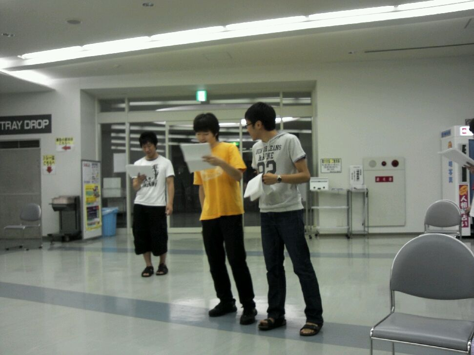

二回生 グルメです

今日は七夕でした(書いてる時点では昨日ですが)

竹を切ったり運んだり割ったりいい汗かいたりしまして、ながしそうめん準備をしました。

準備するがわも楽しいです

毎年恒例の一回生(男子)のコスプレや前座などありましたが、一回生は楽しんでくれたでしょうか、今回コスプレに怒りを覚えた一回生は来年の一回生にその怒りをぶつけてあげてください、こうして負のコスプレ連鎖が出来るのでしょう

イベントは楽しいですね

明日からまた稽古です、メリハリをつけて頑張りましょう

それでは

PS(竹の断面はちょっと甘い)

## 夏公なう！

どもども、2回生の散葉です！！

先輩なんて立場にガクブルしたり、一回生のフレッシュさにホクホクしたりと日々楽しい稽古をしております(\*´∀｀)

今日の稽古は、ふつーにシーンを回していっていたのですが……

実は我がチーム、まだ完璧に配役が決まったわけではないのです！(ババン！

上回下回入り乱れて役を奪い合うアグレッシブな稽古場で、私も必死に食らいついていました(笑)

初っ端からフルスロットルなこのパワーで、夏を盛り上げて行きますよっっ(\*｀・ω・´)

……てすと？何それ美味しいの？

写真は我らが2回生の最終兵器はじめと、それに挑んでいった犠牲者です。
