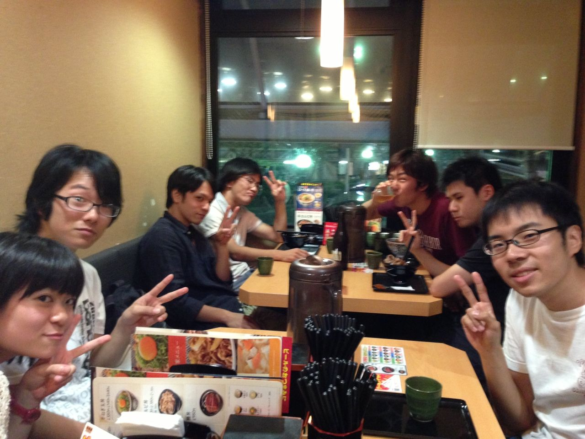
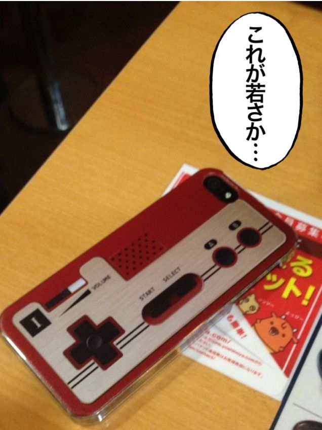

＼ヒッジリ～ン／

うー☆(イメージです。実際の物とは異なる場合があります。)

お疲れさまです。2回生のはじめです。

稽古後、飯行きました。

写真手前のテーブルにいるのは阪急組です。一回生で増えました。

阪急がふえるよ！！ やったね はじめ！ (おいばかやめろ)

僕のiPhoneカバー はファミコンコントローラなのですが、ファミコンコントローラを知らない一回生がいて、時代の流れを感じ、「俺もう老人なんだな…」と思った。
