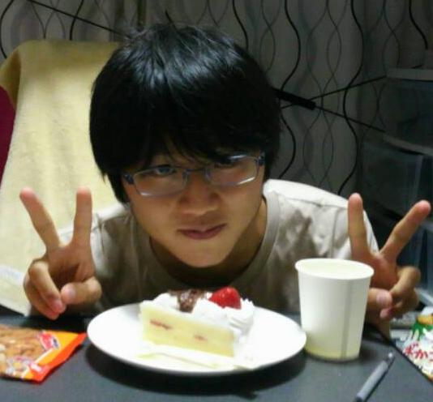

皆さんこんにちわ。万絵巻一回生のやまなクションといいます。

当チームの今年度一回生によるブログ執筆のトップバッターということで、なかなかに緊張しております。

さて、今回のお題目は「他己（たこ）紹介」！

私としましてはあまり馴染みがないといいますか、最初に口頭で聞いたときは十本足の頭足類について熱く語らなくてはならないのかと驚きましたが、どうやら違うようです。

自分以外の万一回生についての紹介をしよう、ということでして、これから数日間、当チームの一回生が五十音順に一つ後ろの人間を語っていきます。

さて、前置きが長くなりましたが、最後までどうかお付き合いください。

今回私が紹介するのは「雨堤　大典」君です。

彼のあだ名は「有吉」なのですが、これは、彼からにじみ出る圧倒的有吉成分の成せる業ですね。

そんな彼は優しげな雰囲気を漂わせつつ、細やかな気配りを忘れないナイスガイで、今や万一回生内のアイドル的存在です。

また、会話における喋る側と聞く側との配分の絶妙なバランス感覚は、ちょっと位分けてくれてもいいのではないかと思います。

惜しむらくは、私は彼とは基本的に駄弁っていることが多く、特技などを垣間見る機会に恵まれていません。

ですので、これから先とても楽しみですね！

と、ハードル上げを行ったところで、何だか長くなってしまいましたが、そろそろ筆を置くことにします。

7/10は有吉のお誕生日でした。おめでとう！

そこで、最後は有吉のご尊顔で締めくくらせていただきます。それでは。
