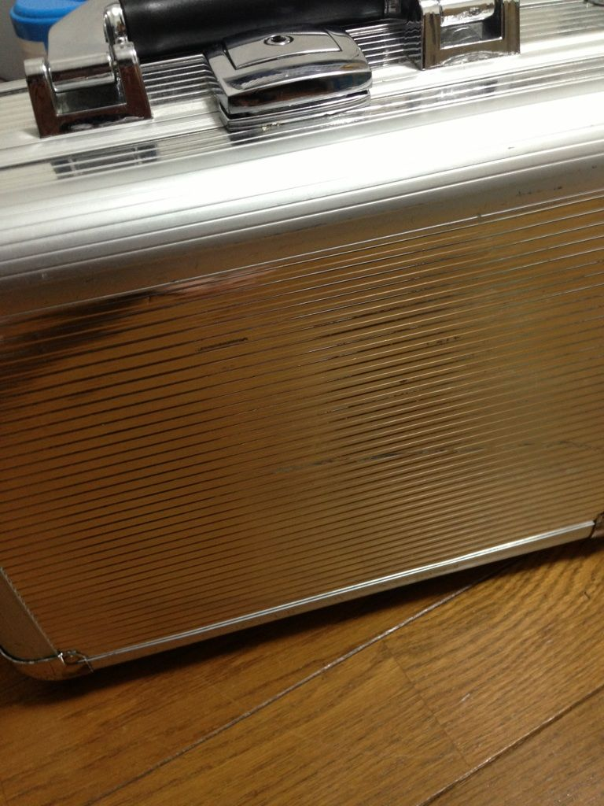

今晩は、皆さん。

初めましての方は初めまして。暑い日が続きますが、いかがお過ごしでしょうか。

世間はバルスですね。私も先程、無事にバルスの儀を済ませました。

というわけで。バルスに埋もれてしまいそうだったので、少しお時間を遅らせてお送りさせて頂いております。

今日ブログ担当に任命されました、4回生で音響をやっています、オリオンと申します。

よく3回生とか間違えられますが、「　4　　回　生　」です。今年入ってから数字の重みが半端ない。

オーラが無いのか。そうなのか。オーラが来いよ。

名前だけイカツいですが、見た目はそんなにイカツくないです。

学校のホールの授業とかで「オリオンさぁーん！！！」とか呼ばれたらうわあああああああってなるので、できればやめていただきたい。

この前は「一回生向けに講座でもするかな・・・(ドヤ顔」てな感じにイカツいヘッドフォンを学校に持っていたんですが、綺麗さっぱり忘れて帰宅しました。(正直いうとあんまり大きいヘッドフォン使ったことない)

後日きちんと回収して、たまに使っています。

えー、今日はテスト明けというわけで、さっそく音響の私も稽古を見に行きました。

音響やってると作業の合間とかに稽古場に行ってついついチョケたりしてしまうんですが、今日も案の定だいたいチョケたりしてましたね・・・

ちゃんと仕事もしてますよ！！あ、当たり前じゃないですか・・・！(震え声)

　　　　　　―――このままではまずい。なんかチョケただけの日記になってしまう。

というわけで、ここぞとばかりに、少し音響が何してるのか書き連ねたいと思います。

現在私は、どこに音入れるか＆音鳴らすタイミング等を稽古を見ながら練り練りしています。並行して、実際に公演で使う音を探したりもしてます。

主に、BGM（バックグラウンドミュージック）と呼ばれるものと、SE（効果音）なるものを探します。なかなか骨の折れる作業ですが、こういう感じで音響なりにがんばってます。

写真は、持っていると向かい側のビルにいるヒットマンにでも打たれそうな物騒な箱ですね。

中身はというと、実は効果音(SE)を出すための機材です。手短に言うとデュクシ！！とか、バーン！！がこの中に入っています。

このカッコいい箱を持ち運んで狙われてる感を楽しめるのも、音響の特権だったりします。たのしい。

というわけで夏公演、音にも期待してください。きっといい音出しますから・・・(ドヤァ
