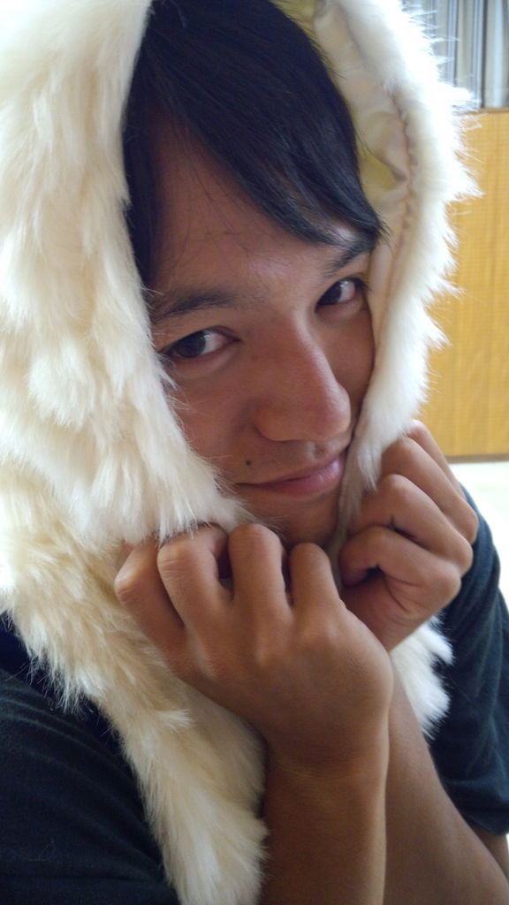
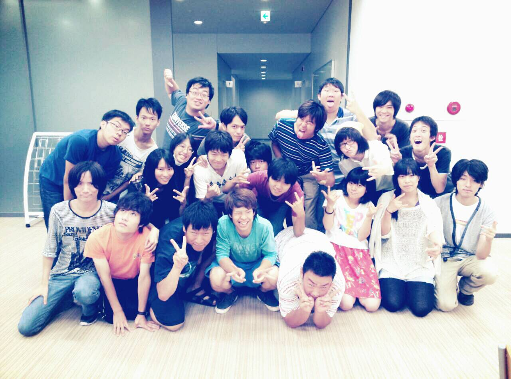

おはようございます！アルゴでございます

本当は昨日のブログを書くはずだったのですが、あまりの疲れで寝てしまいました。

昨日は10時から9時まで稽古しました

初の長時間稽古ということで、通しも二回やったり、いつもより濃い練習ができたのですが、最後のほうはみなさんヘロヘロでした。

13期生の灰猫さんなど、ゲストもきてくれました。みんなダメ出しをもらって一喜一憂しておりました。

さて、練習期間は残すところ今日を入れてあと三日となってしまいました。その次の日は本番です。

思えばあっという間でしたね。

ここでいろいろ書きたいのですが、それは終わってからにします。

残り少ないですが、悔いの無いように頑張りましょう

## かえってきたキャサリン

Hi,

おひさひぶりだよ、キャサリンです、思い出してください

稽古最終日稽古場突入してきました

知らない人いっぱいいました

めっちゃどんびかれました

馴れました

ってかんじでした今日。

ぼくは応援しかできませんでしたが、影からひじたんを疎ましげに見ながら

みんなにエールを送ってます

あっ、メープルクッキーもしかしたら残ってるのとtim のホットチョコレート買ったから飲みまひょーうまいんすよこれが

新しいメンバーが加入し、これまで以上に騒がしく元気におもしろくパワーアップした夏公演を、楽しみにしてます、そしてお楽しみにってかんじっす

まじめになりましたが、最後に聖おにいさん'sで集合写真とったもんであげますね。

みんなと会うの楽しみじゃあああああ
