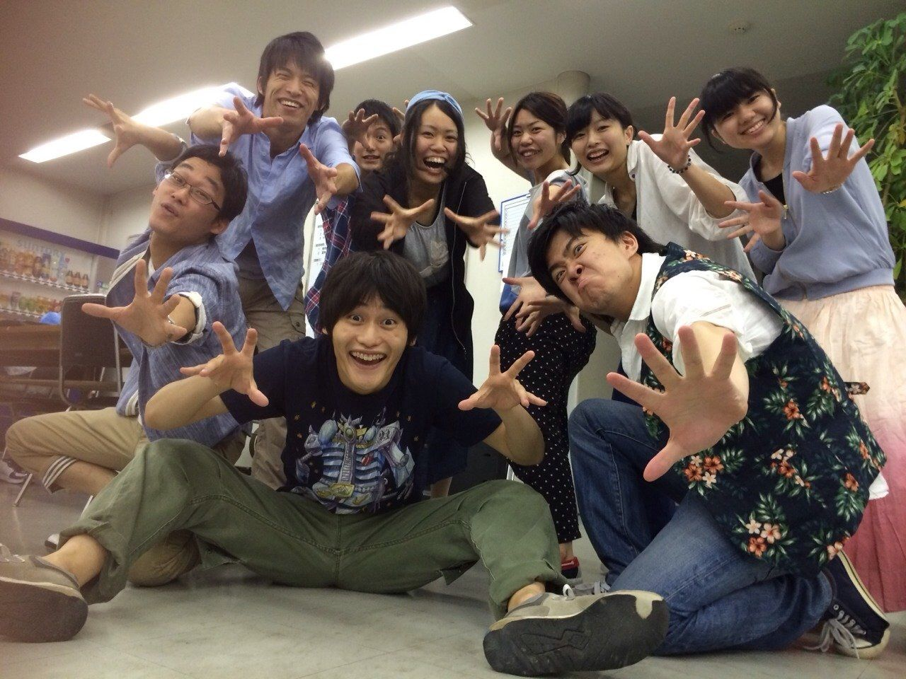

初夏をいかがお過ごしでしょうか？

2回生のスナフキンです。

万絵巻恒例の夏公演がはじまりました！OBさん、OGさん是非見に来てくださいね。

さて、今日は演出不在の自主練の稽古でした。最初はみんなテンションが上がらないようだったので、全力で一回やってみよう！と鞭を入れると、一変して声量が増え、テンションMAXになり、稽古場も笑い笑いのオンパレードになりました。

一回生もやる気満々の様子なので、うれしいです！！

この勢いで7月も全力ダッシュしていまっせ！

iPhoneから送信
