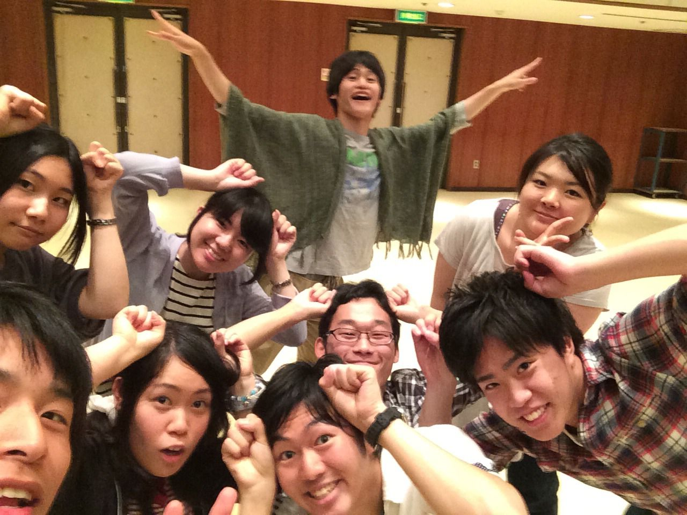

日中の気温も著しく増してきており、夏を感じ始めるこの頃。

こんにちわ。

何だか最近いつにも増してワチャワチャしており申し訳ない限りのやまナクションです。

さて、本日は富田のふれあい大ホールにてスタッフ会議及び稽古が行われました。

今回のメンバーは一回生と四回生が中心で、新入りの初々しさと長上の方々の気迫、その両方が踊り跳ねる力強い、それでいて笑いの絶えない稽古となりました。

私は稽古は最近ご無沙汰気味ではありますが、こういった光景を見ていると疼いてくるものがありますね。

今から、この劇の完成形が待ち遠しい限りです。

乞うご期待！といいつつ、小道具のデザインに頭を捻る、小道具担当がお送り致しました。

それではー

## 夢の国へ

おつかれさまです

三回生のともしです！

この度ふぶきさんのチームに入りました。

今日は夢の国へ行ってる演出さんを差し置いて、みんなで稽古してました！

2回生が仕切ってるのを見ると3回生になったという実感が徐々にわいてきました。

やはり回生ごとに夏公への見方が変わってきますね……

まあ楽しむことにはかわりないんですけど！(笑)

これからの一回生の成長とどんな公演になるのかが楽しみです！

では！
