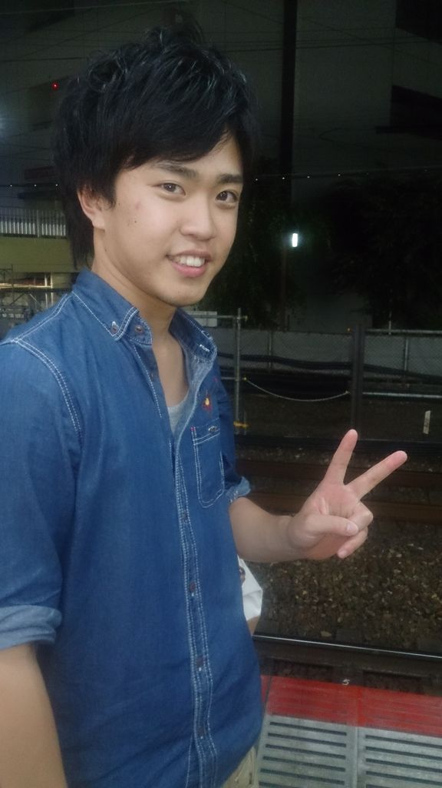
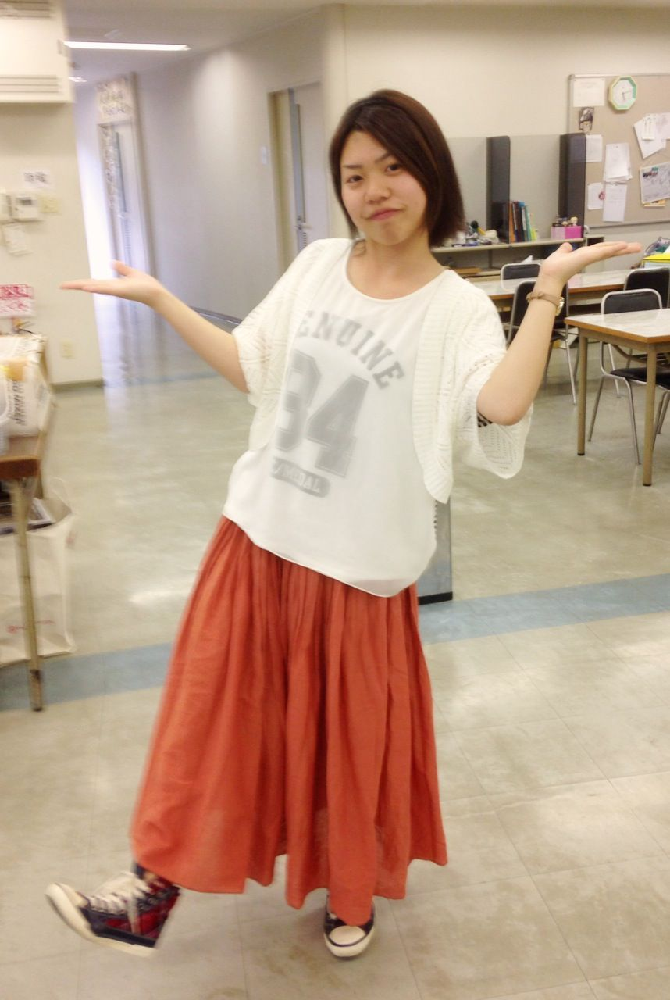

皆様、私のことをご存知でしょうか？

知らないですよね！そうですよね！？

すいません！！

私は一回生の夜王(やおう)と申します！

こんな名前ですが中身は生まれたての小鹿が如くピュアなんです！

信じて下さい！！(切実)

さて馬鹿な前置きはさておき、

ついに万絵巻の夏が始まりましたね！

私にははじめてのことなので、まだ右も左も分からず不安でありますが、それ以上にわくわくもしています！

先輩方の良いところをどんどん吸収していきたいですね！

さてここで少し自己紹介を

好きなアーティストはMr.Children、最近のマイブームはガンダムです！

卵焼きは醤油派です！！

そして最近の野望は他のチームに負けないくらい面白い演劇をする事、

そしてこのブログを読んでくださった皆様と本番の日にお会いすることです！(見に来てくださりますよね？)

これから暑い日が続きますが、熱中症などには気をつけて、本番の日にお会いしましょう！

その日がくるまでどうか皆様お元気で！！

## 一回生紹介第二弾！

わたくしのことはご存知でしょうか？

もちろん知らない人の方が多いですね笑

朝は"走る"ことから始まる…一回生ほのかです！！

穂乃 果 では御座いません穂乃 花 でございます！

7月に入ってますます蒸し暑くなりましたね。昨日なんてついに！

ついに！？

蝉の声を聞いてしまいました！！夏の到来を感じた瞬間でしたL(゜□゜)」

ではでは自己紹介を

高校時代は演劇・和太鼓・ギター部に所属しておりました！

漫画にゲームにお絵かきと好きなことは沢山あります。もちろん演劇大好きです！(・∀・)ノ

卵焼きは"塩"派でございます(醤油なんて…塩ええですよ塩！！)

一応…一応！！(大事なことなので2回言いました。)経験者ですがやはり高校と違ってレベルが違いすぎる大学演劇に追いつくのがやっとの今日この頃です。

いつか先輩方のような演劇ができるよう、この夏先輩方にしがみつきながら万絵巻の演劇を学んでいきたいと思っております！！

ふぶもんチームは今日も今日とて楽しい稽古でした！

夏はまだまだこれからでございます！はりきっていきましょー！！！
