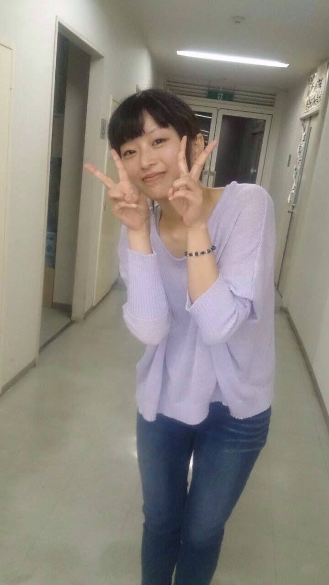

どうもはじめまして

みなさま私のことはご存知でしょうか？

いつバイト先の社畜になってしまうんだろうとここ最近ずっと怯えている、一回生の りん と申します！

名前の由来はラブライブでもボカロでもございません！

ちっち とか りん とかいろいろなあだ名で呼ばれていますが、特にこだわりはないのでお好きにお呼びください！

さて、それでは少し自己紹介をば。

生まれは大阪、育ちも大阪の生粋の大阪人です！

ちなみに地元のゆるキャラはきりんです（笑）

ゲーム、アニメ、漫画は大好きです！勧められたらジャンル問わずやります！！

演劇経験はありませんが、精一杯頑張りますのでよろしくお願いします！！

あと、卵焼きは王道の出汁派です（ドヤ）

本日七月七日は七夕ですね！

皆さんは短冊に何とお願いを書きますか？

私はいっぱいあり過ぎてまだ決まっておりません（笑）

そんな七夕な今日の劇団ふぶいてるもんは演出不在でしたがいつものように楽しく稽古ができました！

バイト二連勤の後の稽古はこれ以上ないくらいに楽しいですね…！

明日の稽古も水分補給を忘れず頑張って行きましょー！！( ´ ▽ \` )ﾉ

以上、ふぶもんチーム一回生が一人 りんがお送りしました！
