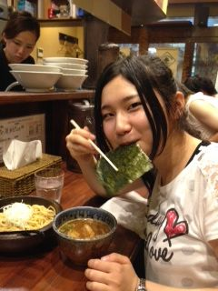
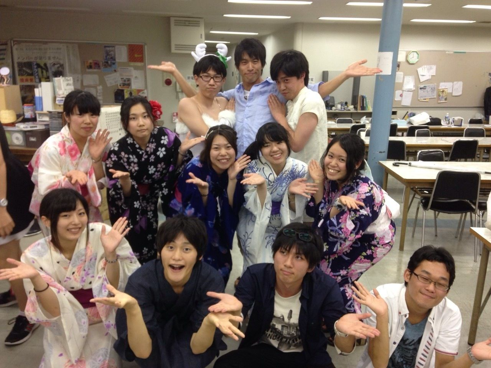

はじめまして。

みなさま、私のことはご存知でしょうか？

今回、役者と音響をさせて頂くことになりました1回生の如月です！

全然食べるキャラとかじゃないですよ？？

演劇については全くの素人で、右も左も分からないかんじなのですが、頑張っていきたいと思います！！

それでは少し自己紹介を。

高校時代は茶道部と放送部に入っていました！

なので趣味は茶道と、あとは漫画読んだりアニメ見たりです！！

ちなみに卵焼きは醤油とみりんを入れるのが好きです。笑

今日はぐっと蒸し暑くなって、ちょっと外で発声するだけですぐに汗だくになってしまいました…

まだまだ至らないところだらけですが稽古はとってもたのしいです！

この夏で少しでも成長できるよう、精進していきたいと思います。

いやはや稽古終わりに食べるらーめんは美味しいですね。

## たなばた！

こんばんは。朝か昼に見てたらどんまい。演出です。

一回生紹介ばっかり続くと思うなよ！

今日は万絵巻の恒例イベント、七夕でした。そうめん流したりねるねるねるねしたり＼(^o^)／たのしい！

あと、女の子の浴衣って、素敵やん？みんな浴衣着てるから、めっちゃ素敵やん？言いたかっただけですありがとうございます。

織姫と彦星も見れたし、今年もよい七夕となりました。

竹を準備してくれた方々、そして幹事のあーみんに感謝しつつお家に帰ります。でわまた。

写真はチームで撮ったやつです。上の三人がオススメです。嘘です。
