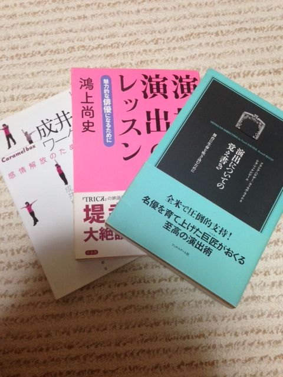
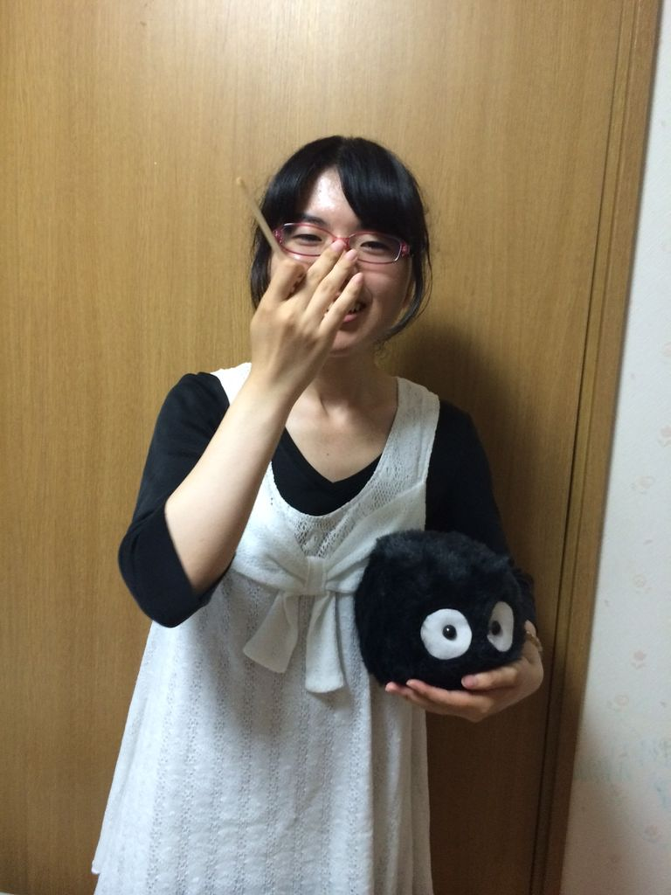

今日は台風の予定でした。

甲子園ではマエケンが投げる予定でした。

でも、台風は来ませんでした。

マエケンはスライドして、授業は平常通り。

あれだけ休講期待させといて、来ないなんて、まるで

俺「今度、空いてる時、遊びに行こうよ！ドライブとか」

女の子「いいですね！行きたいです！」

俺「じゃあ、また空いてる時教えて！俺、予定あけるし」

女の子「わかりました。今月はちょっと忙しいのでまた、来月の予定わかったらLINEしますね」

俺「うん、よろしく」

っていって、一ヶ月LINE来ないあれと似てますね。まぁ、誰とはいいませんが笑

あー、タイトル詐欺しかけました。

演劇の話です。

Twitterで僕の友人が演劇の将来について熱く語ってました。

「もしかしたら、学生演劇は滅びるかも知れない。」

そこまで言っていました。

確かに、娯楽が増え、ネットでいくらでもアニメや動画が見れる今、お金を払ってわざわざ劇場にいって演劇なんか見ないかも知れません。

でもね、僕は思うんです。

演劇は残り続けるって。

事実、今年もいっぱい一回生が入ってくれました。

「演劇見たことないけど、好きな声優さんが舞台やってるの知って、興味持ちました。」

演劇なめてんのか、なんてそれ聞いて思うやつは馬鹿です。バカ、バーカwww

なんだっていいんです、大学という一番自由に活動出来る青春の時期に演劇に身を委ねてくれた。

それだけで未来は明るいと思います。

僕は、そんな一回生に四回生の僕が、残せるのは知識と技術はもちろんのこと、演劇の楽しさだと思っています。

大学から演劇始めて、知らん間に芝居が大好きになって、僕は本まで買って勉強しました。

夏の間に一回生もとい下回生になにか少しでも伝えて、演劇をもっともっと好きになってくれれば幸いです。

ひじり

## 一回生紹介第五段！！

皆様はじめまして。

私のことはご存知でしょうか？

ここ最近、どうして1日は24時間しか無いのだろうかと割と真剣に考えている一回生のふうちゃんです。

セブンぼうずに恐怖しエチュードで黒歴史を作りながらも、楽しく稽古に参加させて頂いております。バイトの関係で隔日でしか参加出来ていませんが(ボソッ)

さて、それでは少し自己紹介にお付き合い下さい。

高槻生まれの高槻育ちな生粋の高槻市民です！ただし、中高は京都の学校に通ってました←

コテコテの大阪弁とかわかりませんわー。

アニメ、漫画、ゲームが好きで日課はニコ動で動画を見ることです。笑

ちなみに卵焼きは塩、砂糖、みりんを入れます。甘い卵焼きこそ至上????

本日は荒通しをしました。

今までバラバラだった場面が一つに繋がり、今回の劇の全体像が見えてきた気がします。

先輩方の演技に毎度感嘆しながら、その技術を少しでも多く盗めるようこの夏は頑張って行こうと思います！

それから、明日は球技大会ですね！

残念ながら私は参加することが出来ませんが、熱中症に気を付けつつ皆さん楽しんで来てください。そしてこのチームが優勝してくれたら凄く嬉しいなーなんて言ってみたり。

写真は妹に撮ってもらいました。

まっくろくろすけでておいでー！
