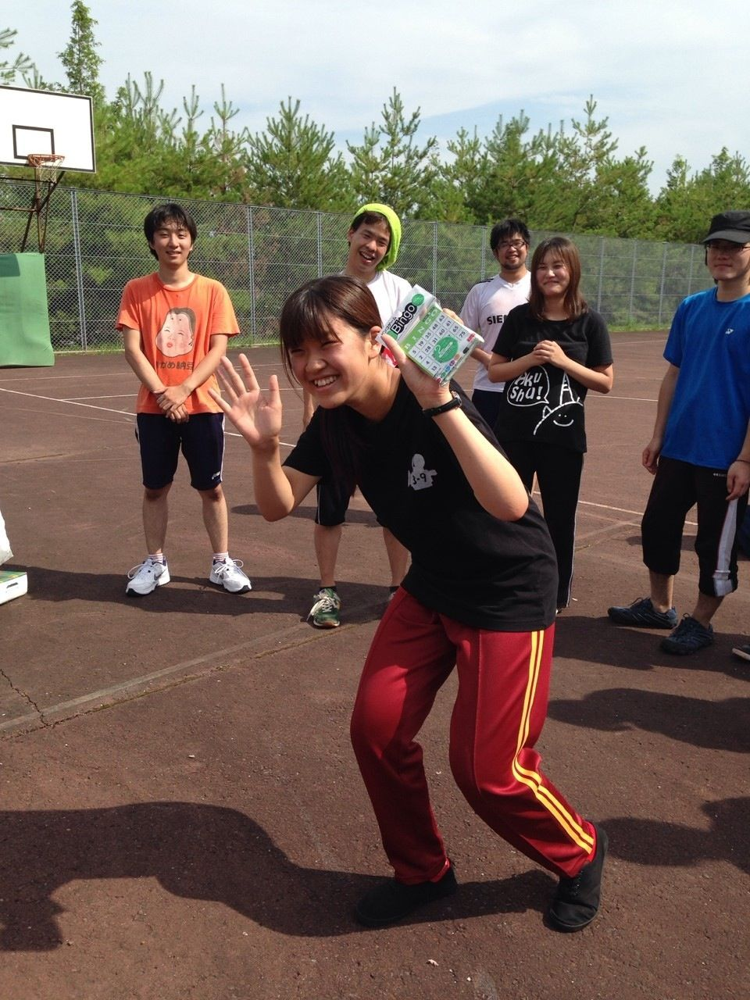
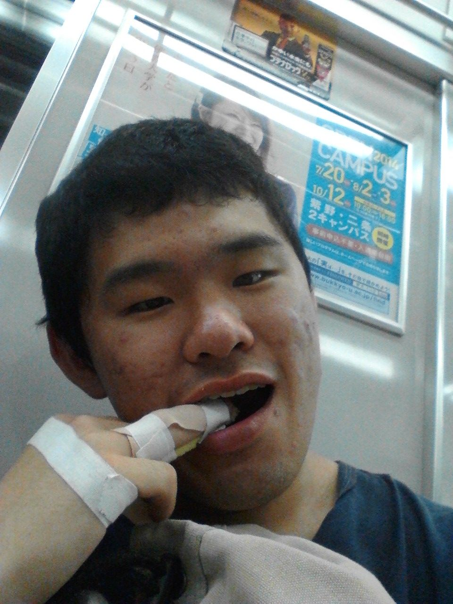
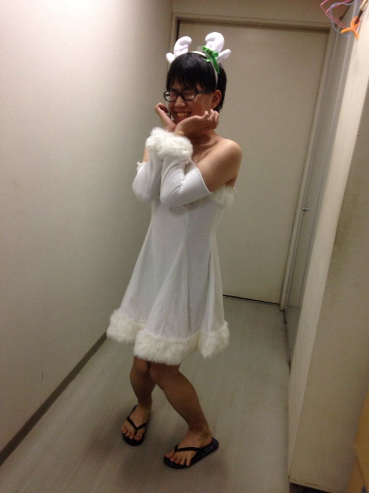

夜分に失礼しますよ、ふぶきです。

今日(というか昨日)はチーム対抗で球技大会がありました！ドッジボールとバスケでそれぞれ鎬を削る暑い熱い戦いとなりました。日焼けが凄いよ！

そして我々ふぶいてるもんは、なんと

それぞれ全勝するという予想外の結果となりました。いやはやありがとうございます。

その球技大会での小話などをちょこちょこ。

実は諸事情により体調不良で挑んだ僕とチームの数名。

午前のドッジボール前に僕たちは考えました。

・体調不良ならしっかり休むべきだ。

→早く勝負を決めれば休憩が増える。

→**そうか、速攻で全員仕留めればいいんだ！**

謎の考えが生まれ、最初から全力で挑み、男子を片っ端から撃破し、相手のパスを遮り、女子すら容赦無く当てるという冷徹なプレイ内容となりました。ホントに余裕無かったですゴメンナサイ。

午後からのバスケは体力が少し回復したということもあり、一回生メインでわいわいやりました。バスケ経験者のたろうくんが「正面からはあかん」という名言を残したのはいい思い出です。バスケできる人ってカッコいいよね。らむ？知らん。

あと、午後から現れたチームメイトのひじりくん。

「幻想は解決されていく」と英語で書かれたTシャツに必勝ハチマキで現れたひじりくん。

蜂蜜レモンを朝に作り、作り方がそもそも危うく、もはやただのレモンだったひじりくん。

脱臼マンは今回も絶好調でした。次はちゃんとしたやつを作ってくるそうです。

そんなこんなでやっぱり今年も濃い球技大会でした。いやー楽しかった！突き指さえしなければもっと楽しかった！親指使えないのがもう！もうね！

水泳大会もしてみたいと思いつつ、まあ叶わぬ夢だろうなーと悟りつつ、今日はこの辺でさよならです。写真は今大会MVPのわじー。冬花チームの一回生です。動きがとても独特です。

## 指美味しい

みなさん僕の事をご存じでしょうか？

らむです。

今日も今日とて稽古です。

僕は手が痛いです。

薬指辺りが痛いです。

何もしてないので痛いです。

剥離骨折なんですよ。

子供の頃、温泉で走りまわって転けた時と同じくらい痛いです。

車海老って知ってます？

串にさして揚げると曲がらないんですよ。

ぼくの指も串に指して揚げたら曲がらないようになるかなぁ…

パネルディスカッションだいすき らむでしたー。

ヤベェ

## 一回生紹介第六弾？！！！

皆さん、私のことをご存知でしょうか？一回生の新人と申します。2回生、3回生になっても新人です。

夏公では小道具と音響を担当させて貰うことになりました。

完全な演劇初心者ですが頑張りたいと思います！(教習の技能とかで練習にはほとんど行けていませんが…

それでは少し自己紹介を

一日中ゲームしてるほどのゲーム好きです。何もない日は半日くらいゲームしてます。漫画やアニメもちょくちょく見てます。ニコ動でゲーム実況をよく見てます。愛読書はジャンプです！10年以上読んでます。写真でも分かるように女装趣味はありません。

ちなみに卵焼きはだし派です。(塩とか醤油とかちょっと何言ってるか分からない。

夏真っ盛りで暑いのですね、稽古中の熱中症に気をつけて頑張りましょー
