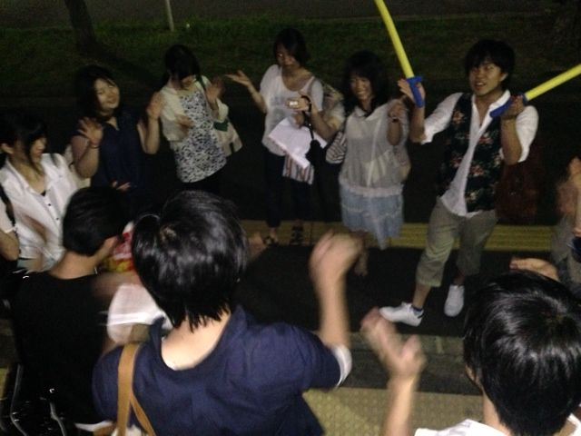
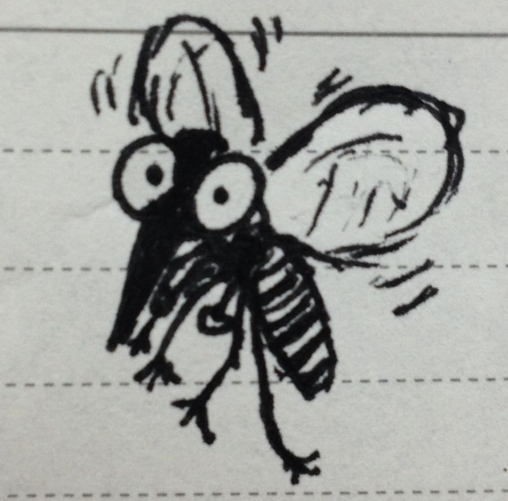

2回生のスナフキンと申します。

つくづく日本語って難しいなあと感じます。

「ありがとうございます」って言う時、「ありがとうございました」っていうのは、実はあまりよくない表現らしくて、感謝の気持ちは現在なんだから、過去形にするのはよくないらしいんです。でも、実はそれでも良いという説もあって。。。

大学生になってから、バイトなり人間関係なりで敬語を使うことがとても増えたので、日本語の使い方って大事だなと感じます。

ちょっと堅苦しくなっちゃいましたが、劇団ふぶいてるもんは今日の稽古も元気だったよ！！

ありがとうございます！

iPhoneから送信

## どーん！

4回生どーん！

たろうどーん！

今日の数字は６！

なにかなー？なんの数字かなー？

どーん！

発声から基礎練の間に蚊に刺された数でーす！どーん！

まじかよー！どーん！

しかも僕蚊に刺されたらめっちゃ膨らむんですよ！腫れるんですよ！

普通の人の3倍ぐらいだと思います！

めっちゃかゆい

なんか僕虫刺されに弱い体質なんでしょうね！

困ったもんだぜ！どーん！

でも、もうかゆくないからオールオッケー！どーん！

明日からはちゃんとムヒと虫除けを携帯するぜ！どーん！

どーん！

ちなみに今日の晩御飯は

ステーキのぉ......どーん！
