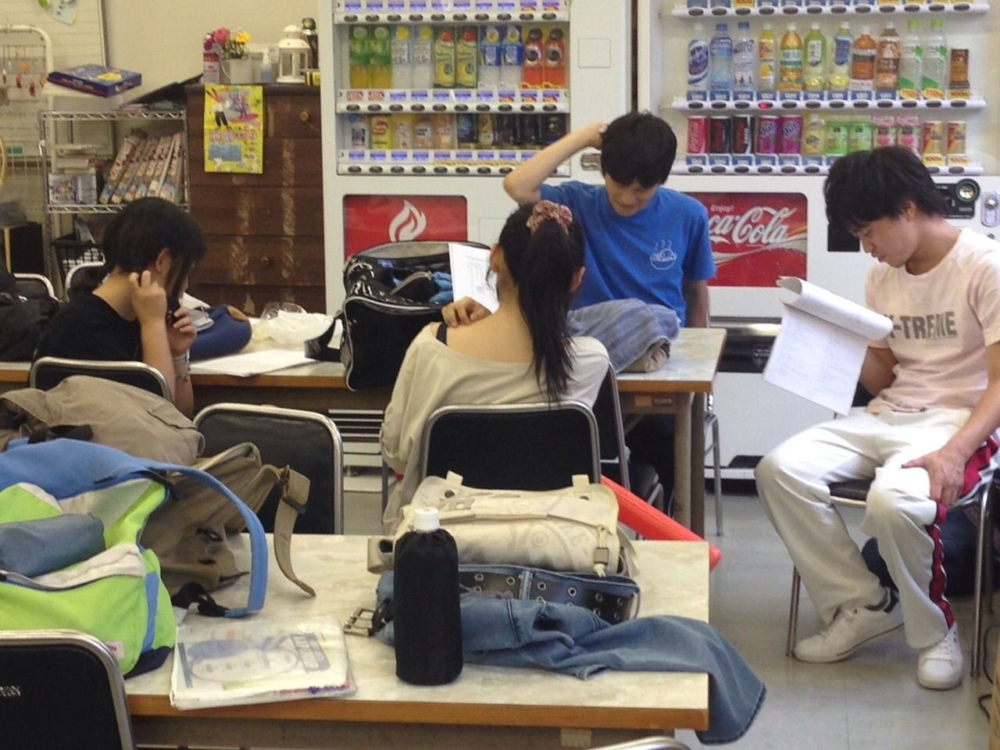

テンション重ねあげてブログ書いてくださいとか言われましたけど普通に「！」をつけるぐらいしか無理なもーりんです！！やっほい！！

語彙力？知りません。

今日は時間があったのでしっかりと発声しましたよ\*\\(^o^)/\*一回生の声がどんどん大きくなって感動でした！！

そのあとは(恐怖の)エチュード祭りでした！！毎回エチュードでは心しか折れてませんね通常★運転

そのあとはシーン練でしたー！テンションあげてシーン練するの楽しいです！！その分疲れますけどねうふふふ☆

そしてふぶもんチームは今日で7月分の稽古が終わりました。テスト休みです。

…あとね、テストが終わる頃には台詞覚えの締め切りが待ってます。そう！！台詞覚えの！！締め切りです！！わぁい！！

とまあ長々と失礼いたしました…！今後もふぶもんチームは突っ走っていきますのでぜひ皆様夏公遊びに来てください！！

はい、私の役目おーわりっ★
