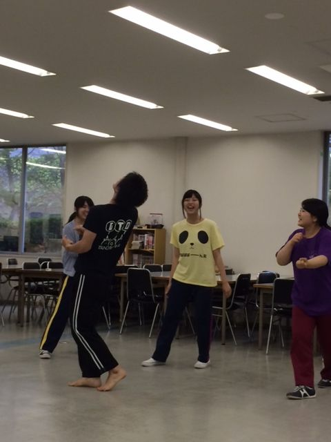

みなさんお久しぶりです演出です。

今日でテスト期間が無事(？)終わり、我々ふぶもんチームの稽古も再び始まりました。

やー、久々にみんなの顔を見たような感覚でした。

そりゃそうだね、10日近く集まってなかったからね。

あ、僕はテスト期間バイトばっかりやってました。8月はあんまり出来ないので今の内に…と思いまして。おかげで休みはほとんど働きました。ある種充実してましたね。わあい。

という訳で再開しましたね、夏公。あと一ヶ月切りましたね、本番。

…………うん！キャンプが楽しみだなあ！

ま、まあ現実もほどほどに見ながらチーム一同で頑張っていきます！がむしゃらにいくぞー！うおー！

さてさておなかすいたのでご飯食べます。それではー

## 稽古日記

もはや新鮮な感じないがない3度目まして(たぶん)もーりんです。

今日正式に、遅刻者(寝坊)とか無断欠席者には罰金を支払ってもらうという制度が出来ました。

いやー遅刻はダメですからね！こういう制度があってもいいと思います。

そして基礎練で椅子使った発声したんですけど腹筋がつるかと思いました(真顔)

あと台本締め切りが昨日だったのできちんと台本を離して、色んなシーンをどんどん詰めていかないといけないなあと感じました。

皆様の前での披露まであと28日…頑張ります！！

写真は全力エチュードの模様です。

(ボケツッコミエチュードは二度としたくない)
