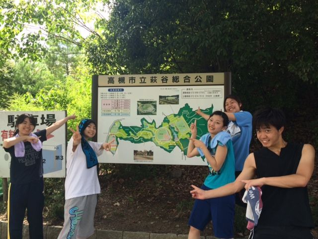

こんにちは！なつのです。

今日の稽古には、万絵巻OBのライスさんが来てくださいました！

ありがとうございます！

ふとした指摘によって気づくことが多くて、OBさん方が遊びに来てくださるのは、本当にありがたいです。

またぜひ来てください！

今日の午前中は、今年の夏初めて萩谷公園まで走りましたよ！

幾日か前から雨が続いていたお天気が、サッと晴れて、とてもいい天気の中走ることができました。

公園で休憩中にちょっと遊んだりして、楽しかったです。

走ったおかげで、みんな疲れてはいましたが発声が良くなっていた気がします。運動って大事ですね。

いよいよ明日に通しを控えて、稽古もいつも以上に集中して行いました。

今まで出来ていなかったところが、だんだんと完成形に近づいています。

これからの稽古も楽しみです！

iPhoneから送信
