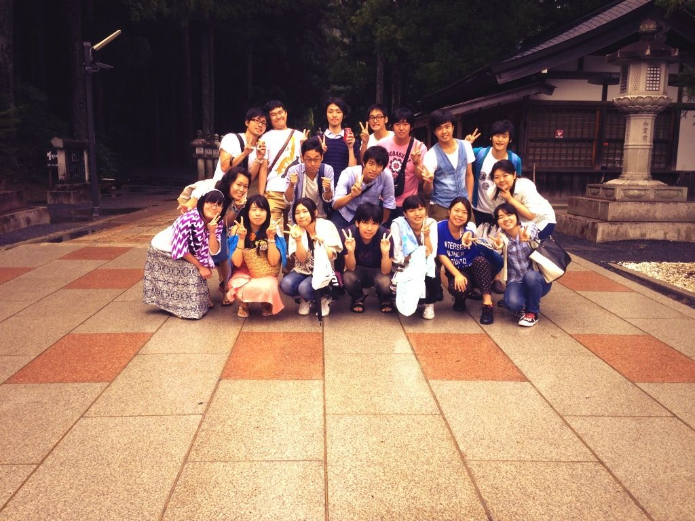

どうも。アイスは氷菓派、演出です。

さて、我々ふぶもんチームは先日8/7～9の三日間でキャンプに行ってきました！

昨日帰ってすぐに寝てしまったので報告が遅れました。タイトルの＋１はそういうことです。

行ってきたのは山です。奈良なのか和歌山なのか、とにかく山です。トトロとか居そうなアレ。

電波が無く外界から隔離された数日を過ごすこととなり、これ以上ないまでに自然を満喫できました。カブトやらクワガタやらも見つけました。わあい。

１日目は移動とBBQ。男だらけの車内で男子会トークを延々と繰り広げ、BBQで嫌いな食べ物を克服すべく様々な食物が焼かれていきました。僕の分は油断してたら別メニューで登場してきました。ほんとに過呼吸になるかと思ったよひじりくん。

２日目にはなんかちょろっと通し稽古もしたりしてね。キャンプ前にしたかったんだけど、タイミングがまるでなかったもんですから。全役者が揃って初めての通しだったのである意味新鮮でした。

あー、こういう芝居が出来上がるのかー、としみじみ思ったり(´ω\` )

午後からは川で遊びました。それはもう全力で。キャメロンの潜在能力が半端なかったです。最後にたろうくんと水切りして山荘に帰りました。跳ねすぎて向こう岸で石が爆散しまくったのは内緒。自然破壊じゃないよ！石だから！石が小さい石になっただけだから！

夕食はカレー、キャンプと言えばやっぱりカレーですね。ウルトラマンのDVDを鑑賞しながら食べるという自宅感全開っぷりでしたがめっちゃ美味しかったです(((o(\*ﾟ▽ﾟ\*)o)))

あ、あと花火もしましたよ。

僕「雨降ってきたな」

ひじり「まじか、じゃあやろう」

※うちのチームは基本的に日本語が不自由です。

最終日は土石流を眺めながらの帰宅となりました。昨日ここで遊んでたんだよな、自然ってすげえな、と小学生並の感想しか浮かばなかったですね。なんかもう、凄すぎて。

台風の影響で色々あったので、大きな怪我やトラブルもなく無事全員揃って帰ってこれたのが何より良かったです。

楽しかったのも当然ありますが、同じ空間で一緒に過ごして、みんなが今までより仲良くなれたのではないでしょうか。いや、確実に仲良くなった。うん。

キャンプ幹事のスナフキン、ド運転手、料理してくれたメンバー、キャンプに参加してくれたチームのみんなに感謝です。

特にスナフキン、本当にありがとう。幹事お疲れ様でした。

ふぶもんチームは明日から稽古再開です。また気合入れ直して駆け抜けますよ！OB,OGの皆さんもいつでも遊びに来てくださいね！全力でお待ちしております\*･゜ﾟ･\*:.｡..｡.:\*･'(\*ﾟ▽ﾟ\*)'･\*:.｡. .｡.:\*･゜ﾟ･\*
