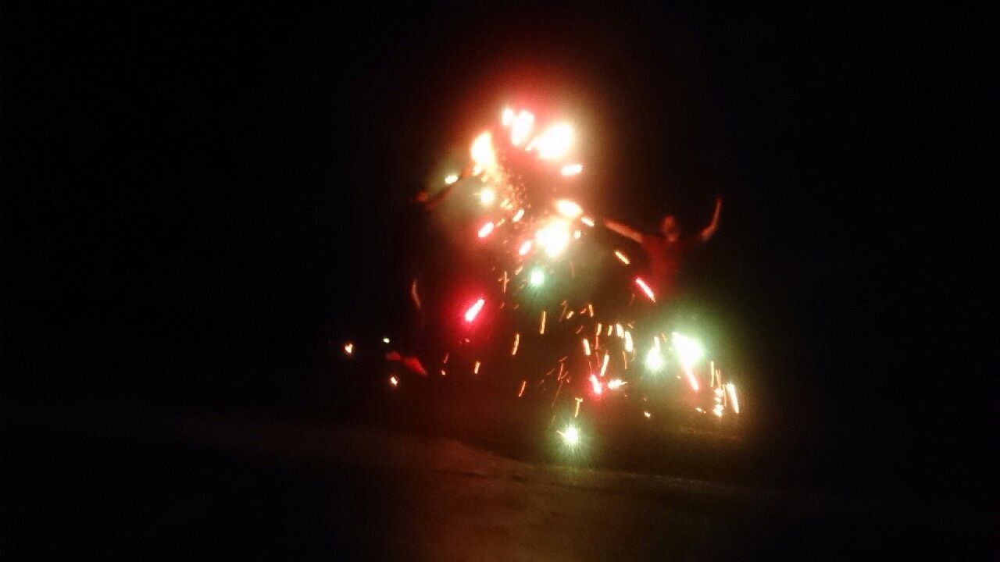
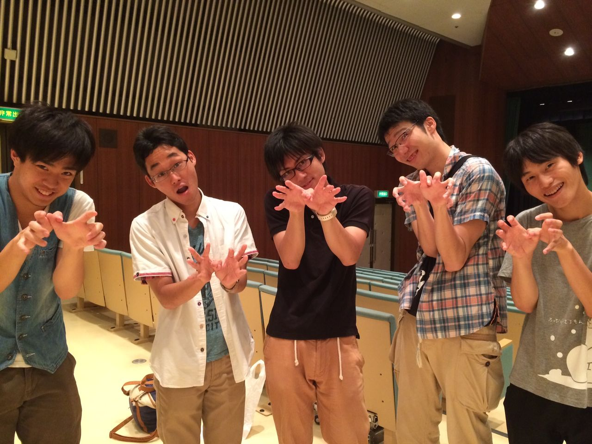

こんにちは、すなふきんです。

先週チームキャンプを終えました。

みんな楽しんでいて、夏公演後半戦も頑張るぞ！という気持ちになりました。

いよいよ後半戦！というかあと少し！！一回生の更なる成長のおかげで、僕も少し緊張しています（笑）。

やはり後輩から、刺激を得るというのも大切なことですね！

観てくださる方に観て良かったなと思っていただけるように、あと少しの期間頑張りたいと思います！！

iPhoneから送信

## 絶好調☆

こんにちは！3回生のなつのです！

今日は稽古場に人が少なくて、少しさみしかったです。

でも、今日の私はなぜか絶好調で、すごく楽しく過ごすことができました！

自分が変な日本語をしゃべっても、切り返してくれるツッコミさんがたくさんいるのは大事だな～と思います。自分はボケツッコミでいうボケ性質だと再確認できました！調子のいいときしかうまくボケることはできませんが。

稽古途中から17期生のとちぎさんが来てくださって、より場が盛り上がりました！ありがとうございます！

もう来ないかもと、つれないことをおっしゃってましたが、またぜひ来て欲しいです！お願いします！

今日は来てない人が残念がるだろうなぁと感じるくらい、盛り上がった稽古でした！

お盆ももう少しであけるので、これからフルスロットルでがんばります！

チームふぶいてるもんをどうぞよろしくお願いします！！！
