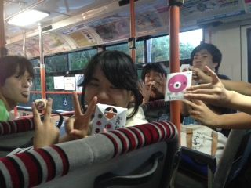

こんにちは！

いつまでたってもセブンぼうずができない一回生の如月です。

もうトラウマです。

今日は久しぶりの学校稽古でした！ひさびさの総情のキャンパス！！

そして！

今日の稽古にはOBのねこさん、へむさん、イーサンさんが来てくださいました\*\\(^o^)/\*

へむさん差し入れありがとうございました！

スイカ美味しかったです♪

もう夏公本番まで2週間もないですが、私自身はまだまだなところが沢山……

残りも気合を入れて練習がんばります！！

写真はふうちゃんの帰省土産のきびだんご！

スタンダードなのと、塩味、黒煙味(黒糖)がありましたよ(笑)

ふうちゃんありがとうヾ(\*´▽｀\*)ノ
