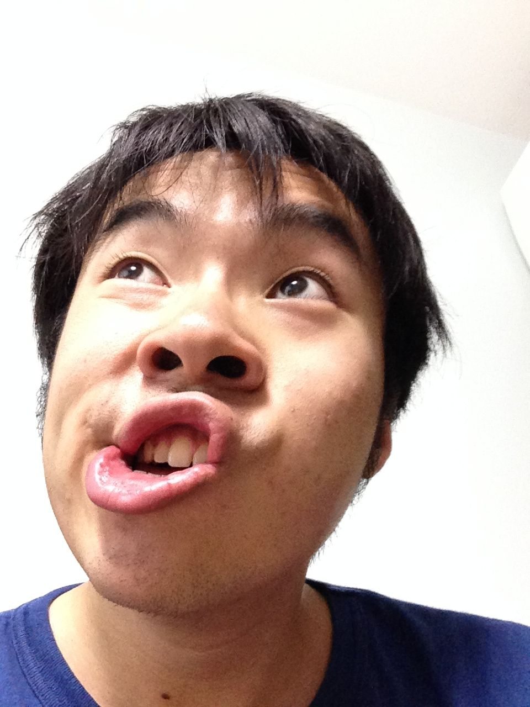
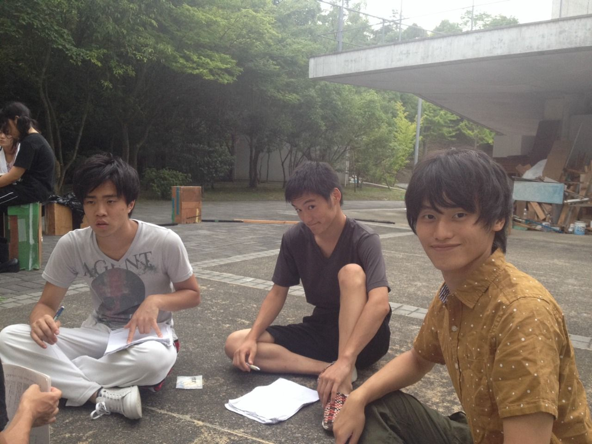

お久しぶりです。3回生のはじめです。

正直、今回夏公にほとんど参加できてません。まあ他の活動あったからね。(スミマセン)

講演当日私は来れませんが、関わった部分は全力でやらせていただきました。

手術をしたり霊圧が消えかけることもあるけれど、それでも私は元気です。

写真がねぇ！ヒャアどうしようもねぇ！顔芸だ！

## 北を護りし玄武

　こんばんは。一回生新人こと亀井です。

今日は、仕込み説明会、総会、通しをしました。（...説明会遅刻して、ごめんなさい。）

通しでは、全体での初オペをしました！！！

途中でパラパラと雨が降ってきたり、ハチみたいなのが襲ってきたりと

アクシデントがありましたが無事終了(\`・ω・´)

オペをやってみてタイミングが難しいなって思ったのと音が入ることで

さらに面白くなるなぁと実感しました！

色々と教えてくれているアリエルさんに感謝感謝です。

本番まで後８日

すごく楽しみです！！！
