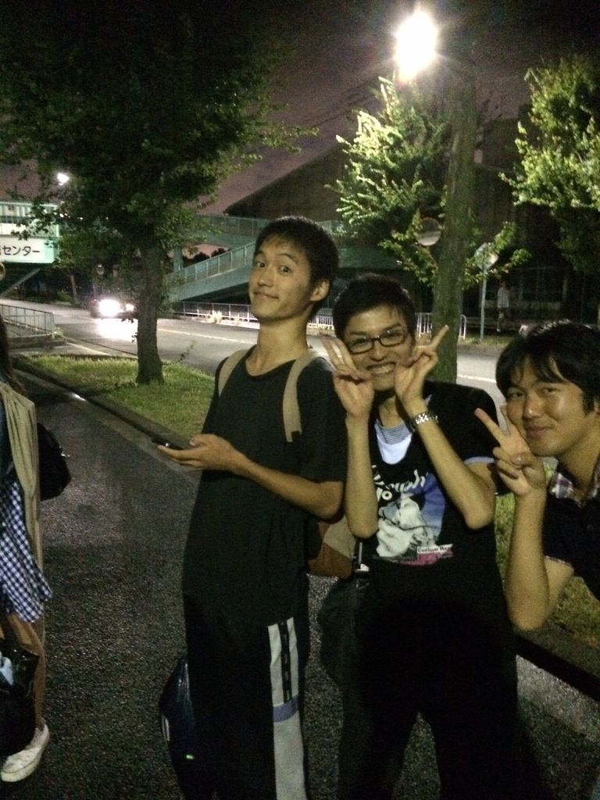
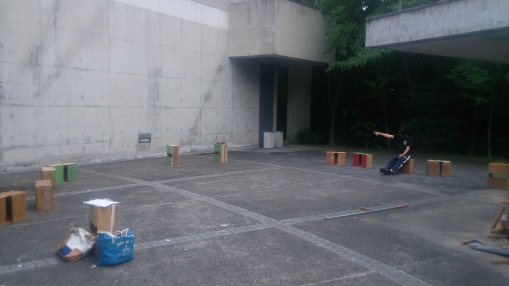
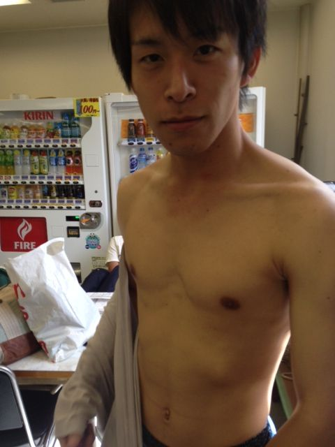

皆さんおはようございます。

小道具担当、やまナクションです。

本当に久々のブログで勝手がイマイチ思い出せない現状ですが、よろしくお願いします。

さて、昨日の稽古は半日稽古ということで、学校とふれあい大ホールをはしごしての活発なものとなりました。

私がいない間にも劇のクオリティは着々と増すばかり。本番が大変楽しみです。

また、ふれあい大ホールにはOBのガリオさんがいらっしゃいました。

上の写真がその御尊顔です。

本当にありがとうございました！

さて、本番はもうすぐ。

寧ろこれから更にヒートアップする劇団ふぶいてるもんをどうぞご刮目あれ。

## 自主練！！！

こんばんわ！やおうです！

ついに、ついに最後の稽古の日を迎えてしまいました((((；゜Д゜)))

考えると怖いですね……(汗)

今自分のシーンの精度を上げるために自主練習をしています。

ここが正念場です！！

さぁ本番はもう目の前に迫ってきました！

今までの稽古の成果をすべてぶつけてやります！

気合い入れていきましょう！！！

## 夏の終わり

八月末です。もうすぐ、夏が終わりですね。ご無沙汰してます。みんなの心のオアシスでありたいと願う男、。ひじりです。

今日は最終稽古でした。

僕は4回生になりましたが、実はあまり役者をやらずに生きてきました。

この夏は、就活も終わり、思い出作りに役者をやろうと考えていました。

なんなら、役者をすれば一回生と絡む機会増えるから、去年までJKだったピチピチの十代をGET出来るんじゃないかと考えていました。(実際、この夏を通して、僕はお洒落で楽しいデートが出来るアピールはしときました。これから個人LINEで予定詰めて行くつもりです。)

そんな軽い気持ちでいざ、稽古が始まると経験不足からか、頭で思ったように体が動かす、オマケに口も動かず、しっちゃかめっちゃかでした。段取りを考えてながら話すとカミカミになり、滑舌意識すると段取り飛んだり……。

本当は教える立場であるべき4回生ですが、みんなの足を引っ張ってしまった様に思います。

それでもみんな僕のことを応援し、一緒に高めあった結果、楽しく観れる芝居になったと今日、最終稽古を終わって感じています。

楽しかった夏。

大学生活ラストにいい思い出が出来ました。

それを通してふと、僕は思いました。

「もう、これが役者最後やな」

そうです。今回は僕の役者としての卒業公演なのです。

もう、二度としません！見納めです！

なので、是非お足を運んでいただければと思っています。

ps 初デートに映画はあり派です。
