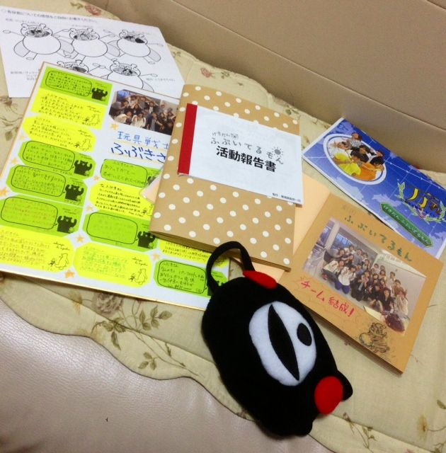

気がつけば公演本番から3日経過してました。演出です。

終わってしまいましたね、夏公演。短くて、長かった。

よろしければ拙い長文にお付き合いください。

6月半ばから始まったこの公演、期間でいえば2ヶ月以上もあったのですね。

初日のチーム発表で戸惑っていた一回生たちも、今ではうちのチームのノリに順応するまで成長しました。嬉しいやら悲しいやら。

当然それだけではありません。芝居に対してもそれぞれの成長が見れました。

僕が夏公の演出として立候補したとき、ふと考えたのが「一回生に何が出来るか？」でした。

自慢ではありませんが演出経験も皆無に等しく、チーム全員を引っ張っていくだけの力も持ち合わせていなかったものですから、演技力をーとか、表現力をーとか、そんなもんはあんまり教えてあげられないだろうなーって思いまして。

じゃあいっそ「演出に頼るんじゃなくて自分たちでも考えて動かなければならん」という感覚を身につけされば良いのでは？となりました。

過剰に干渉せず、自ずから得ようとする思考が根付いてくれればと、飾らず等身大の僕で接してきました。ムードメーカー担当の、演出というよりむしろ主宰のような立ち振る舞いで。

ノリと勢いで決めたりイエスマンだったり、まあそれで混乱を招いたりもしましたが、最終的には全体の成長に繋がったのでは無いかと。

これ以上に無い結果オーライというやつです。うちのチームは確実に「自分で動く力」が他チームより強くなりました。親バカで何が悪い。

アンケートでも予想を超える評価を頂いてしまいまして。中でも最後のシーンを褒めて貰えた事が嬉しかった。

何度も何度も修正を重ね、最後は出演者の納得のいく形に変えるという諸行無常改訂を繰り返し。

で、よく見たら最終版のそれは、初回台本に最も近い形で。

テンポやら何やらと周囲から助言を貰い、魔改造を続けてきた台本。

その連続で方向性を見失いかけていた僕に、

「私たちはふぶきさんの台本がやりたいんです」

と言ってくれた後輩たち。

「お前が演出やねんから、好きなようにしたらええんやで」

と言ってくれた同期たち。

自分ほんまに演出なんかなって思ってた矢先のこの一言が、なんかこう、ね。きたわけですよ、はい。

頼りなかったやろうに、苦労したやろうに。文句一つ言わず…言われたな。嫌な顔一つせずに…結構されたな。

う、うん！そんな感じで！好きにやってノって貰って尻拭いされまくって支えられて、幸せな演出でしたよまったく！みんな大好きだこのやろー！！うわー！！

今回で演出はラストです。悔いはありません。あるけど無い。少なくとも夏公はやり切った。最後の最後で泣きまくったってことは、多分そういうことなのでしょう。

やりたかった台本は他にもありましたが、このチームで「紅蛍」をやれて良かった。

我がチームの愛すべきバカ野郎19人と、お世話になった方々と、紅蛍を見てくれた人達へ。

## 劇団ふぶいてるもん(続きの一文)

本当に本当に、ありがとうございました。

劇団ふぶいてるもん演出 ふぶもん
