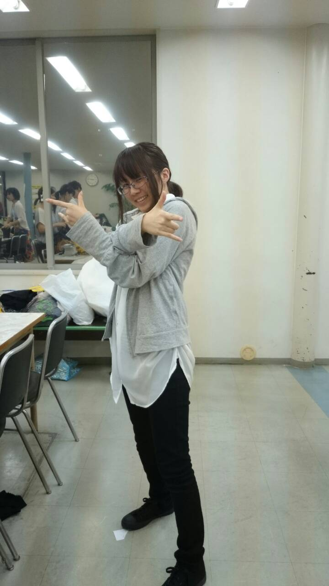

ばんわー

なんか帰りに座った電車の座席が濡れてた一回生のパピーです

稽古も本格的に開始ですね！台本を読んだ時はどうすればいいのかイメージがわきませんでしたけど、実際に動いて見ると形になって驚いていました!

テンション上げてかないと振り落とされるますが、引っ張ってもらいつつも自ずとテンションが上がりますね！

軽く自己紹介

ビニール袋とか空いたお菓子の袋を畳んだりくくったりするのがクセ

弱点は朝が弱いこととこしょこしょが苦手なことですかね!

S棟に漫画置いてる輩は大体私です

習うことがいっぱいで、目まぐるしいですが、いろんなことを身に付けていきいたいです

それでは、次回の更新をお楽しみに!
